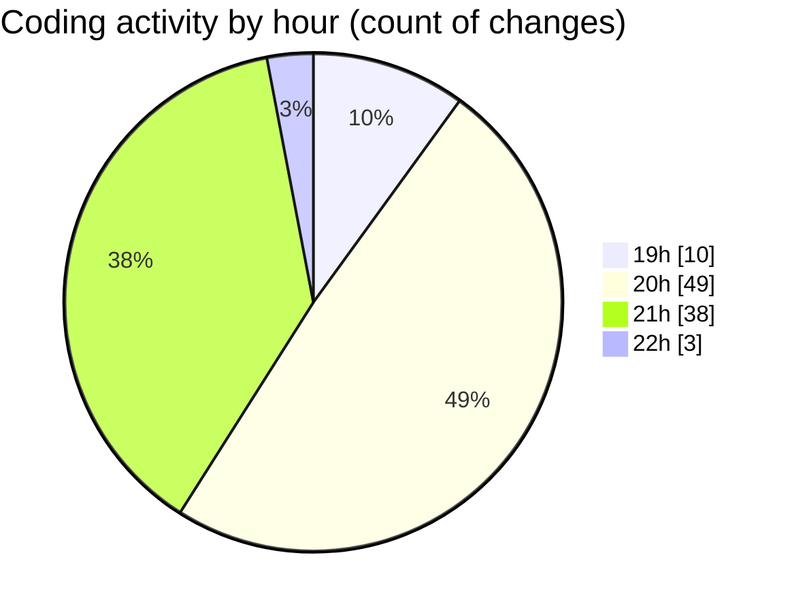

# trollerboard - Activity Summary 

## Overall Statistics

| Stat                   | Value                                                             |
| ---------------------- | ----------------------------------------------------------------- |
| **Lines Added** (➕)   | 2142                                          |
| **Lines Removed** (➖) | 175                                        |
| **Net Change** (↕)    | 1967                |
| **Active Time** (⌚)   | 161 minutes |

## Modified Files
- **package.json** (+35, -0)
- **index.mjs** (+53, -3)
- **settings.json** (+370, -1)
- **lib.rs** (+15, -0)
- **App.jsx** (+739, -98)
- **App.css** (+599, -28)
- **main.rs** (+17, -0)
- **Cargo.toml** (+1, -0)
- **Cargo.toml** (+53, -26)
- **main.rs** (+210, -2)
- **tauri.conf.json** (+50, -17)

## Visualizations

### By File Type (Lines Changed)

### By Hour (Estimated Activity Count)

> **Last Updated:** 1/28/2025, 10:17:40 PM