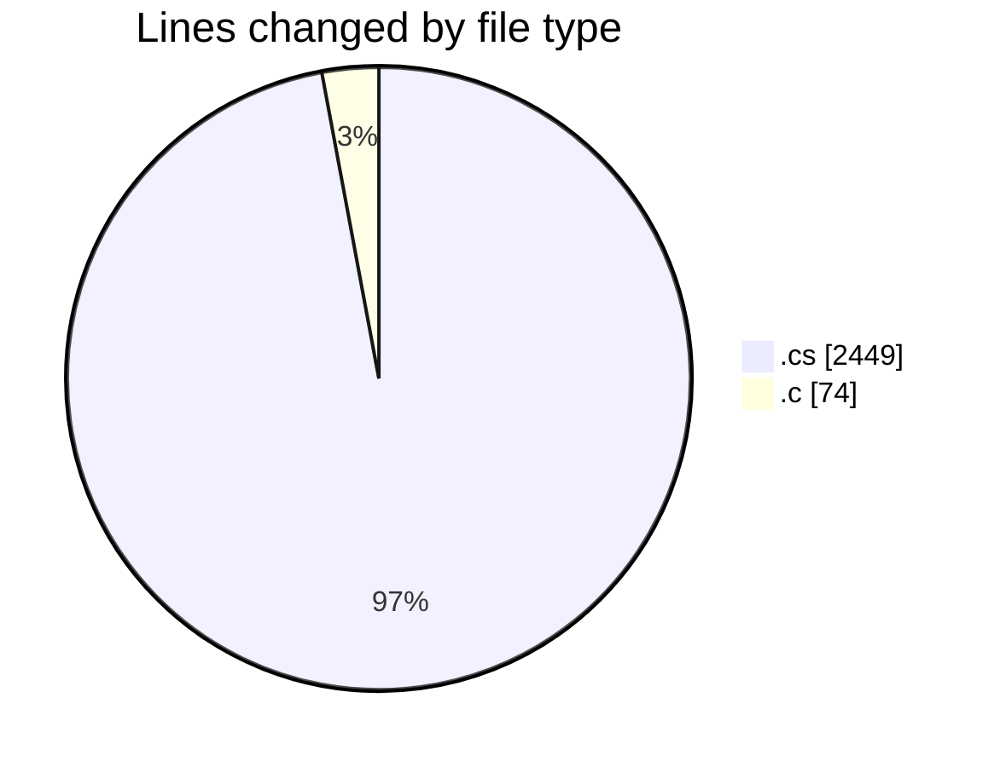
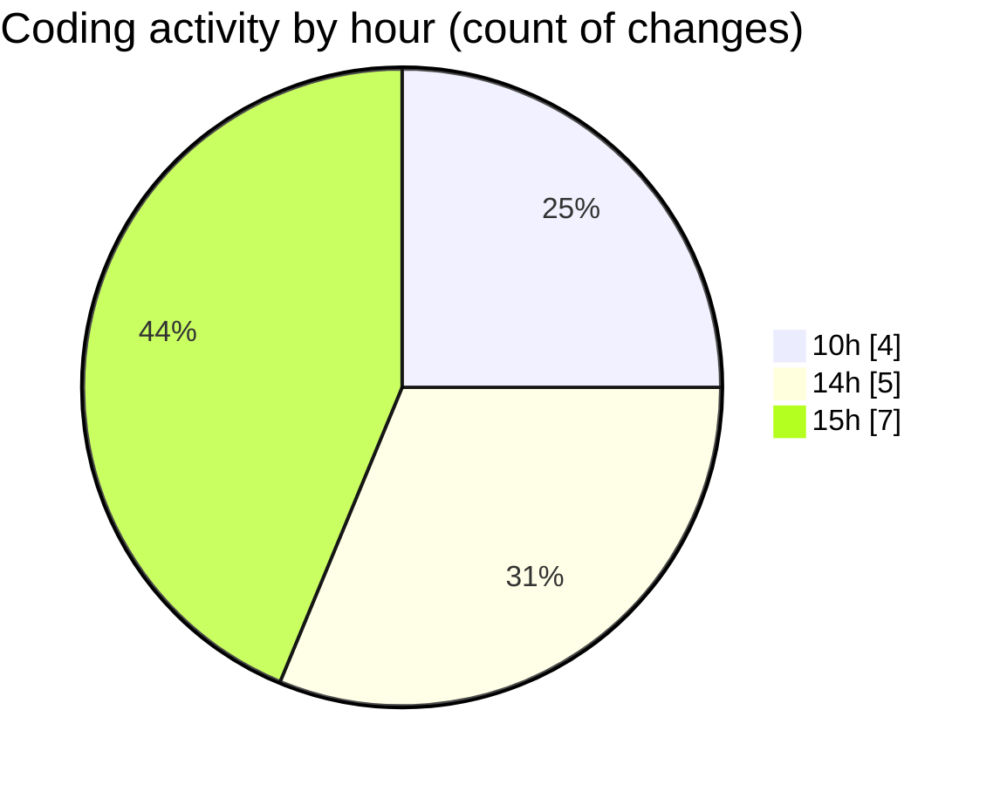

# koderunner - Activity Summary 

## Overall Statistics

| Stat                   | Value                                                             |
| ---------------------- | ----------------------------------------------------------------- |
| **Lines Added** (➕)   | 2332                                          |
| **Lines Removed** (➖) | 191                                        |
| **Net Change** (↕)    | 2141                |
| **Active Time** (⌚)   | 16 minutes |

## Modified Files
- **Program.cs** (+1506, -162)
- **TerminalProcess.cs** (+233, -0)
- **Class1.cs** (+271, -28)
- **microasm.cs** (+249, -0)
- **install.c** (+73, -1)

## Visualizations

### By File Type (Lines Changed)

### By Hour (Estimated Activity Count)

> **Last Updated:** 2/9/2025, 3:07:32 PM