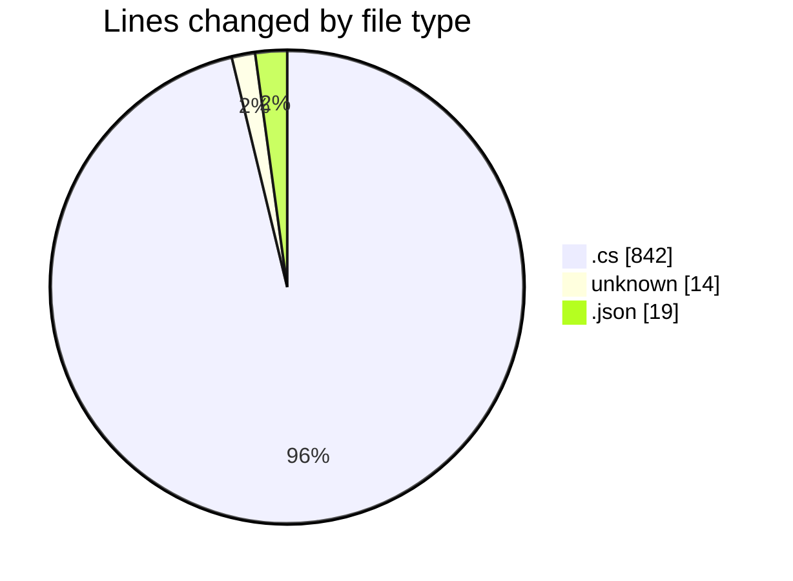
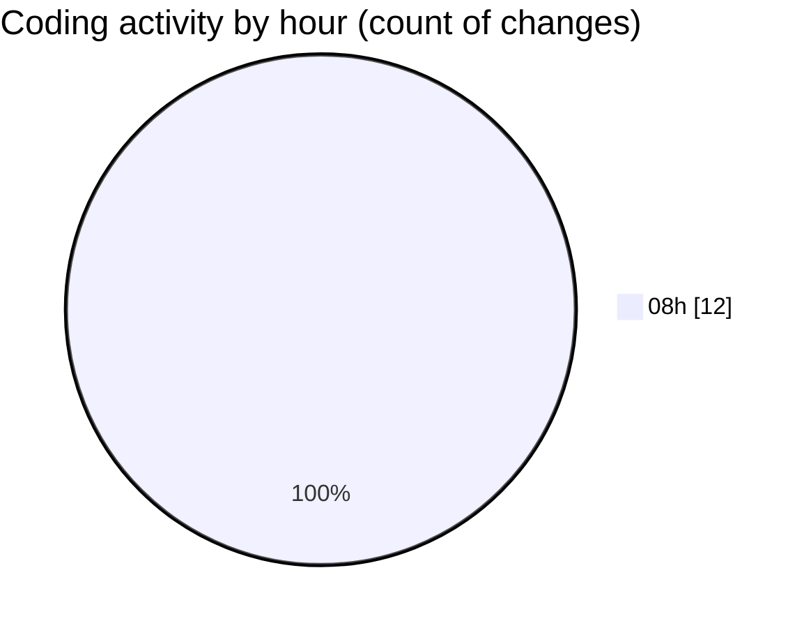

# koderunner - Activity Summary 

## Overall Statistics

| Stat                   | Value                                                             |
| ---------------------- | ----------------------------------------------------------------- |
| **Lines Added** (➕)   | 874                                          |
| **Lines Removed** (➖) | 1                                        |
| **Net Change** (↕)    | 873                |
| **Active Time** (⌚)   | 15 minutes |

## Modified Files
- **Class1.cs** (+235, -0)
- **BuildProcess.cs** (+133, -0)
- **TerminalProcess.cs** (+237, -1)
- **.gitignore** (+14, -0)
- **TerminalProcess.cs** (+236, -0)
- **config.json** (+19, -0)

## Visualizations

### By File Type (Lines Changed)

### By Hour (Estimated Activity Count)

> **Last Updated:** 2/10/2025, 8:12:31 AM