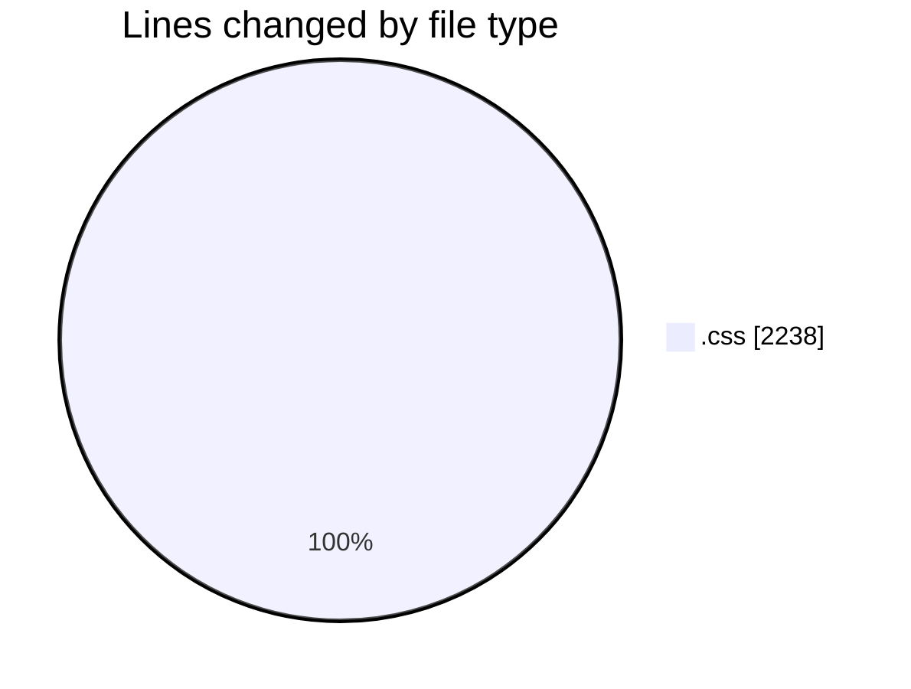
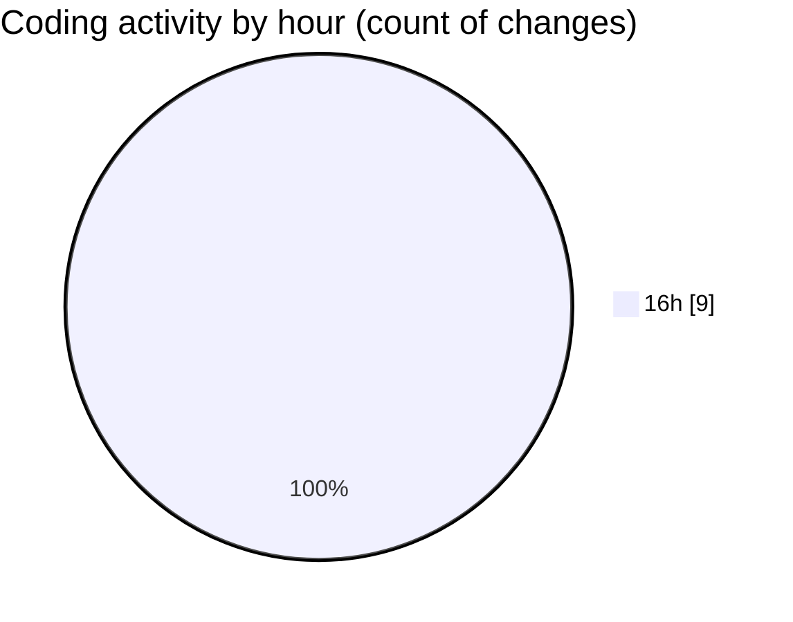

# finite.vercel.app - Activity Summary 

## Overall Statistics

| Stat                   | Value                                                             |
| ---------------------- | ----------------------------------------------------------------- |
| **Lines Added** (➕)   | 2212                                          |
| **Lines Removed** (➖) | 26                                        |
| **Net Change** (↕)    | 2186                |
| **Active Time** (⌚)   | 10 minutes |

## Modified Files
- **App.css** (+429, -26)
- **index.css** (+29, -0)
- **documentation.css** (+1754, -0)

## Visualizations

### By File Type (Lines Changed)

### By Hour (Estimated Activity Count)

> **Last Updated:** 18/02/2025, 16:58:30