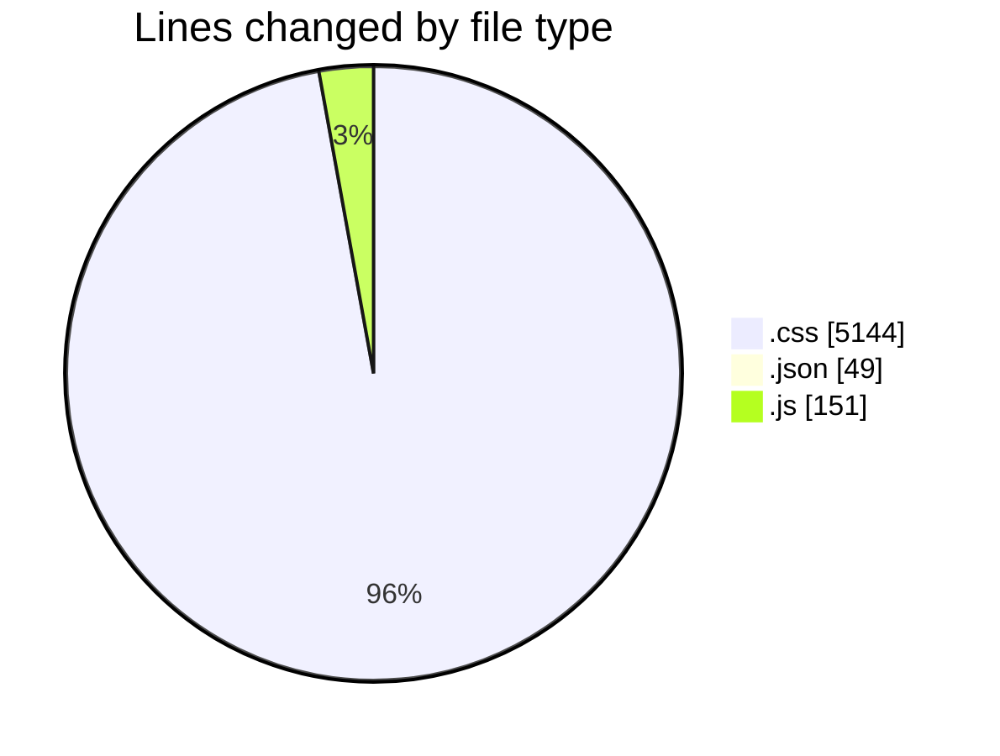
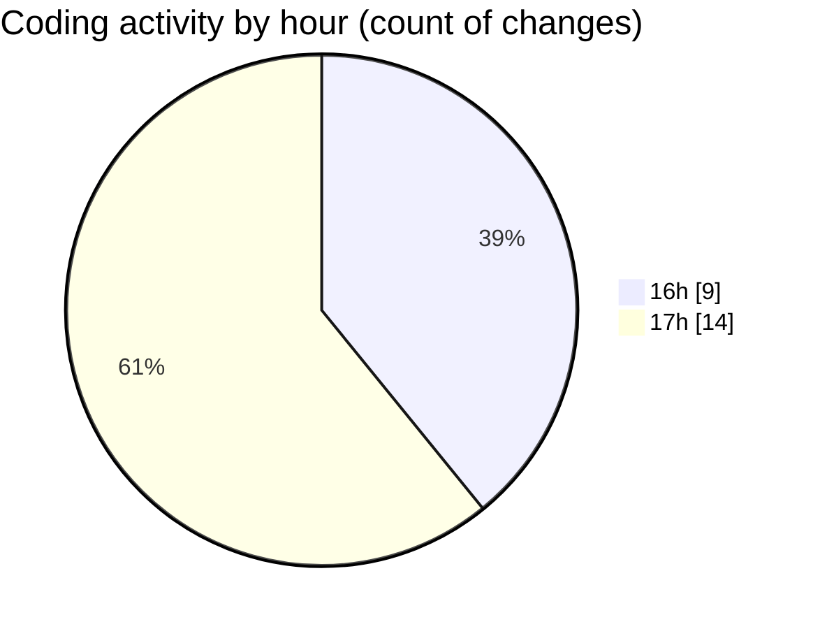

# finite.vercel.app - Activity Summary 

## Overall Statistics

| Stat                   | Value                                                             |
| ---------------------- | ----------------------------------------------------------------- |
| **Lines Added** (➕)   | 3864                                          |
| **Lines Removed** (➖) | 1480                                        |
| **Net Change** (↕)    | 2384                |
| **Active Time** (⌚)   | 21 minutes |

## Modified Files
- **App.css** (+445, -42)
- **index.css** (+47, -18)
- **documentation.css** (+3173, -1419)
- **package.json** (+49, -0)
- **data.js** (+150, -1)

## Visualizations

### By File Type (Lines Changed)

### By Hour (Estimated Activity Count)

> **Last Updated:** 18/02/2025, 17:13:30