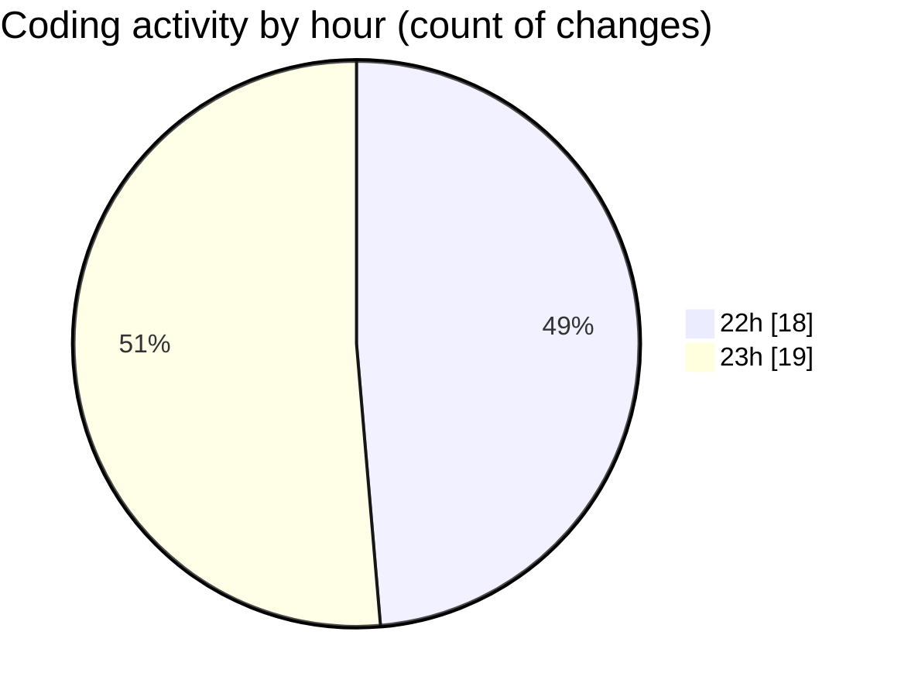

# MASM - Activity Summary 

## Overall Statistics

| Stat                   | Value                                                             |
| ---------------------- | ----------------------------------------------------------------- |
| **Lines Added** (➕)   | 3669                                          |
| **Lines Removed** (➖) | 158                                        |
| **Net Change** (↕)    | 3511                |
| **Active Time** (⌚)   | 41 minutes |

## Modified Files
- **MasmException.java** (+34, -33)
- **common.java** (+345, -3)
- **Functions.java** (+1949, -55)
- **interp.java** (+1056, -29)
- **instructions.java** (+77, -38)
- **stringoperations.java** (+40, -0)
- **ModuleInit.java** (+127, -0)
- **Functions.java** (+41, -0)

## Visualizations

### By File Type (Lines Changed)

### By Hour (Estimated Activity Count)

> **Last Updated:** 18/02/2025, 23:30:30