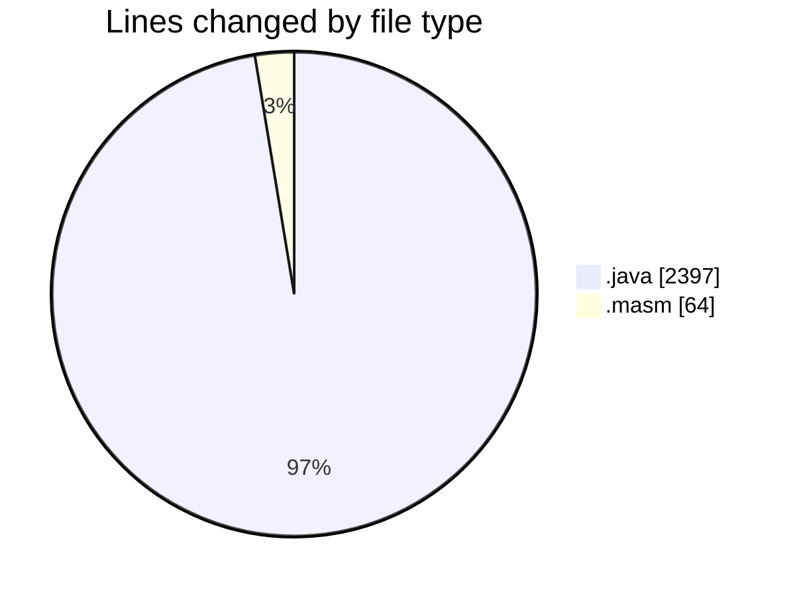
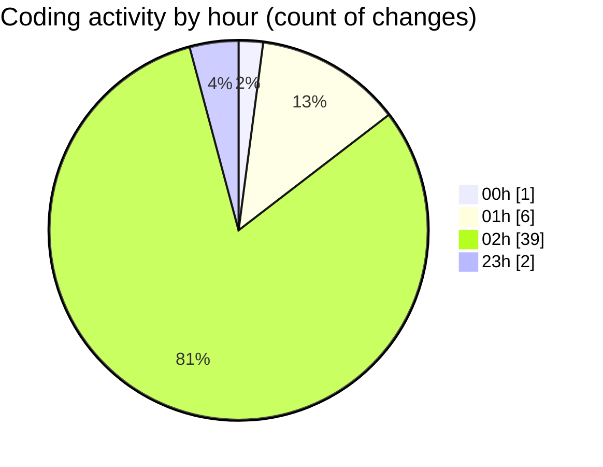

# MASM - Activity Summary 

## Overall Statistics

| Stat                   | Value                                                             |
| ---------------------- | ----------------------------------------------------------------- |
| **Lines Added** (➕)   | 2397                                          |
| **Lines Removed** (➖) | 64                                        |
| **Net Change** (↕)    | 2333                |
| **Active Time** (⌚)   | 53 minutes |

## Modified Files
- **interp.java** (+563, -0)
- **Functions.java** (+1116, -1)
- **main.masm** (+28, -8)
- **FunctionsTest.java** (+489, -7)
- **extras.masm** (+19, -9)
- **stringoperations.java** (+73, -39)
- **MNIMethodObject.java** (+109, -0)

## Visualizations

### By File Type (Lines Changed)

### By Hour (Estimated Activity Count)

> **Last Updated:** 19/02/2025, 02:52:36