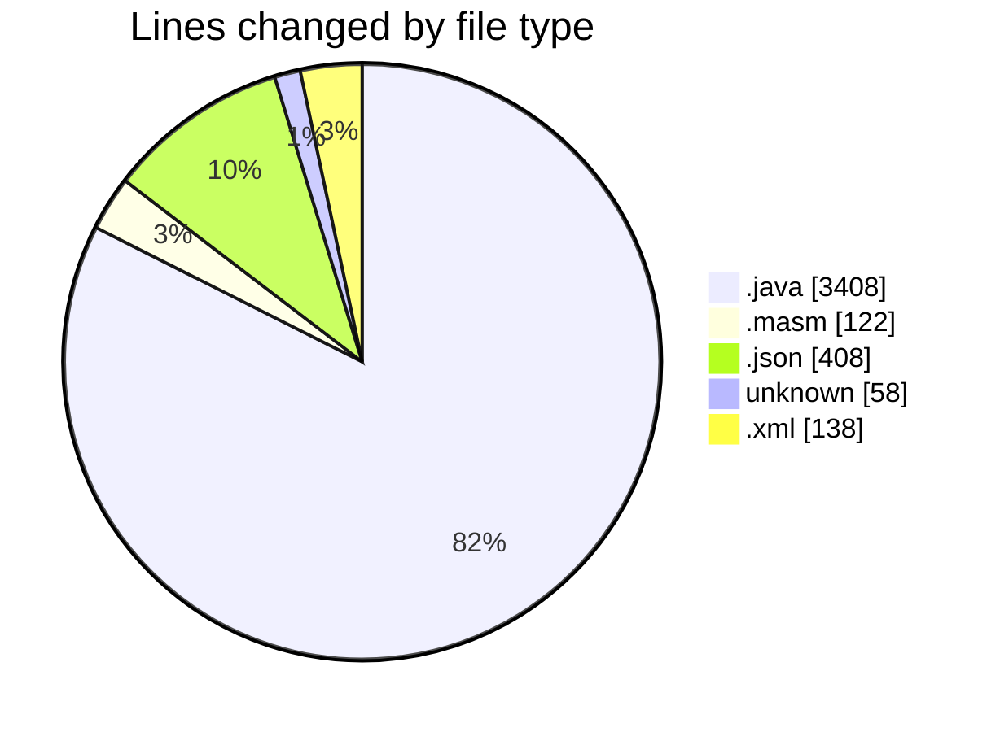
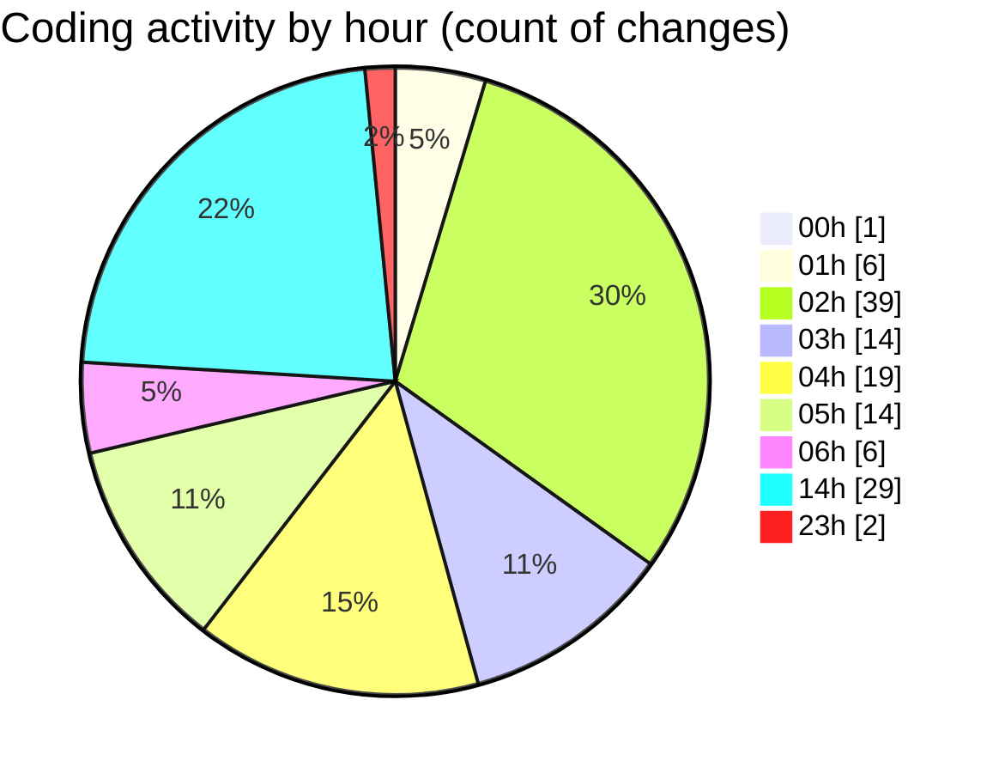

# MASM - Activity Summary 

## Overall Statistics

| Stat                   | Value                                                             |
| ---------------------- | ----------------------------------------------------------------- |
| **Lines Added** (➕)   | 3888                                          |
| **Lines Removed** (➖) | 246                                        |
| **Net Change** (↕)    | 3642                |
| **Active Time** (⌚)   | -496 minute |

## Modified Files
- **interp.java** (+579, -16)
- **Functions.java** (+1116, -1)
- **main.masm** (+28, -17)
- **FunctionsTest.java** (+489, -7)
- **extras.masm** (+24, -23)
- **stringoperations.java** (+92, -65)
- **MNIMethodObject.java** (+145, -0)
- **launch.json** (+22, -1)
- **settings.json** (+9, -0)
- **settings.json** (+376, -0)
- **main.masm** (+8, -0)
- **extras.masm** (+22, -0)
- **ModuleInit.java** (+141, -14)
- **common.java** (+355, -13)
- **.classpath** (+58, -0)
- **logback.xml** (+49, -22)
- **spotbugs-exclude.xml** (+67, -0)
- **includemanager.java** (+190, -67)
- **MASMException.java** (+12, -0)
- **MASMConfig.java** (+51, -0)
- **MemoryManager.java** (+47, -0)
- **IncludeException.java** (+8, -0)

## Visualizations

### By File Type (Lines Changed)

### By Hour (Estimated Activity Count)

> **Last Updated:** 19/02/2025, 06:37:38