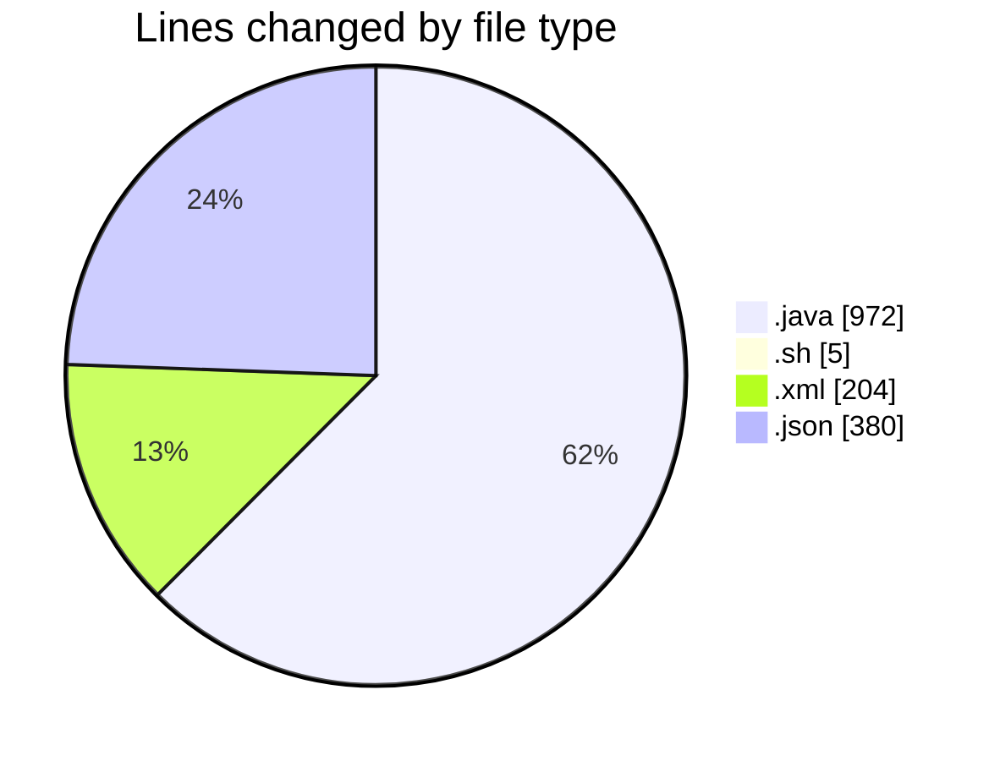
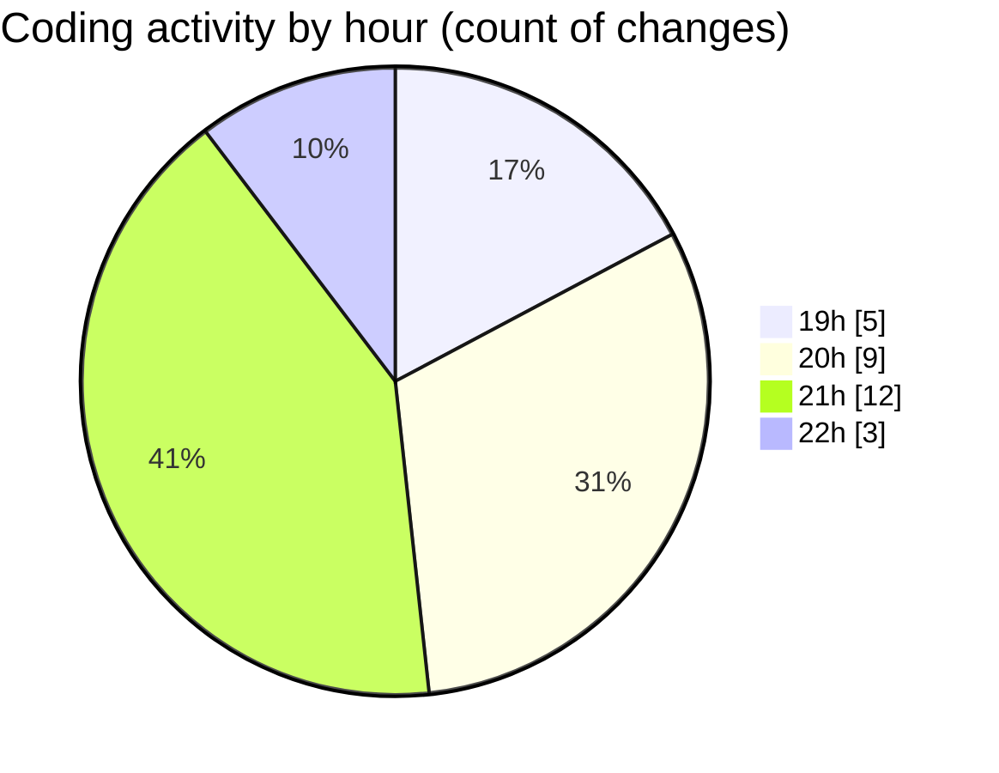

# MicrOS - Activity Summary 

## Overall Statistics

| Stat                   | Value                                                             |
| ---------------------- | ----------------------------------------------------------------- |
| **Lines Added** (➕)   | 1518                                          |
| **Lines Removed** (➖) | 43                                        |
| **Net Change** (↕)    | 1475                |
| **Active Time** (⌚)   | 31 minutes |

## Modified Files
- **Main.java** (+208, -31)
- **MDIWindow.java** (+74, -0)
- **TextEditorWindow.java** (+74, -0)
- **start.sh** (+5, -0)
- **pom.xml** (+204, -0)
- **settings.json** (+377, -0)
- **settings.json** (+3, -0)
- **WindowManager.java** (+158, -12)
- **Console.java** (+166, -0)
- **ProcessManager.java** (+149, -0)
- **Taskbar.java** (+100, -0)

## Visualizations

### By File Type (Lines Changed)

### By Hour (Estimated Activity Count)

> **Last Updated:** 19/02/2025, 22:21:10