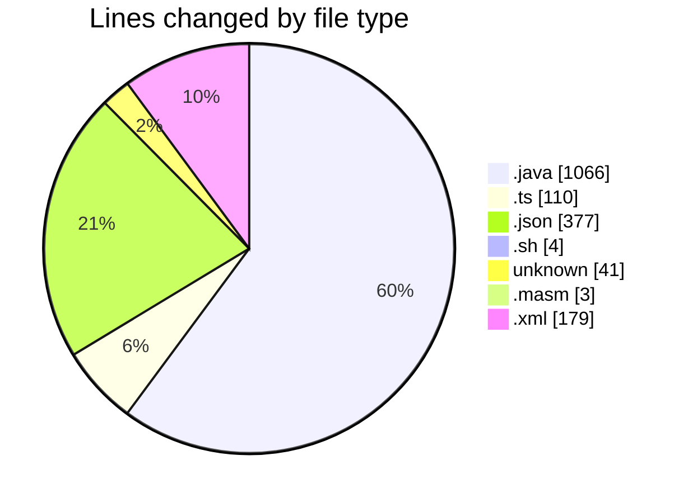
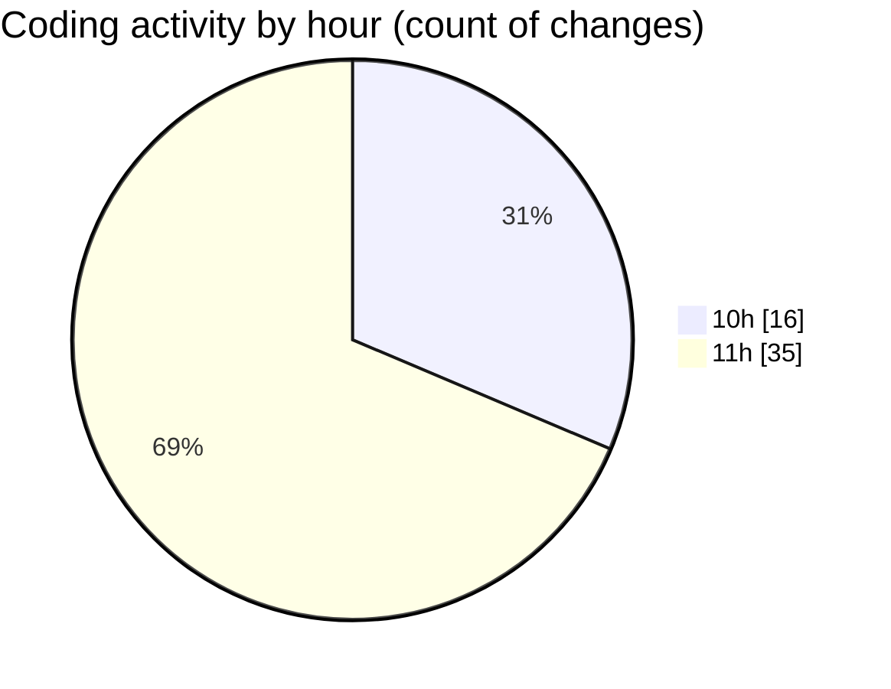

# MicrOS - Activity Summary 

## Overall Statistics

| Stat                   | Value                                                             |
| ---------------------- | ----------------------------------------------------------------- |
| **Lines Added** (➕)   | 1678                                          |
| **Lines Removed** (➖) | 102                                        |
| **Net Change** (↕)    | 1576                |
| **Active Time** (⌚)   | 63 minutes |

## Modified Files
- **FileManager.java** (+440, -0)
- **VirtualFileSystem.java** (+427, -3)
- **BackgroundPanel.java** (+31, -0)
- **Main.java** (+103, -4)
- **FileContextMenuProvider.ts** (+33, -32)
- **FileExplorer.ts** (+23, -22)
- **settings.json** (+377, -0)
- **start.sh** (+4, -0)
- **.gitignore** (+41, -0)
- **main.masm** (+3, -0)
- **interp.java** (+6, -0)
- **instructions.java** (+6, -0)
- **common.java** (+6, -0)
- **AsmRunner.java** (+39, -1)
- **pom.xml** (+139, -40)

## Visualizations

### By File Type (Lines Changed)

### By Hour (Estimated Activity Count)

> **Last Updated:** 20/02/2025, 11:53:37