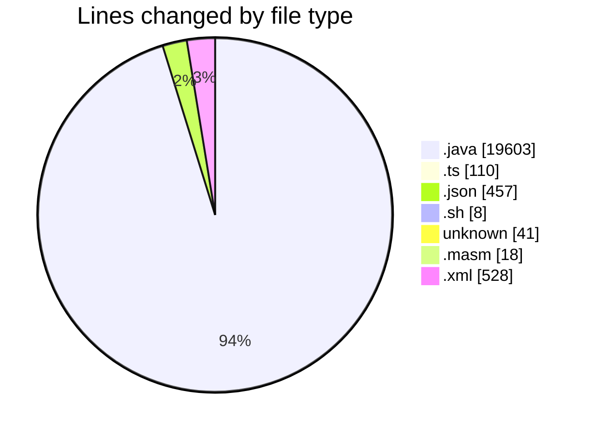
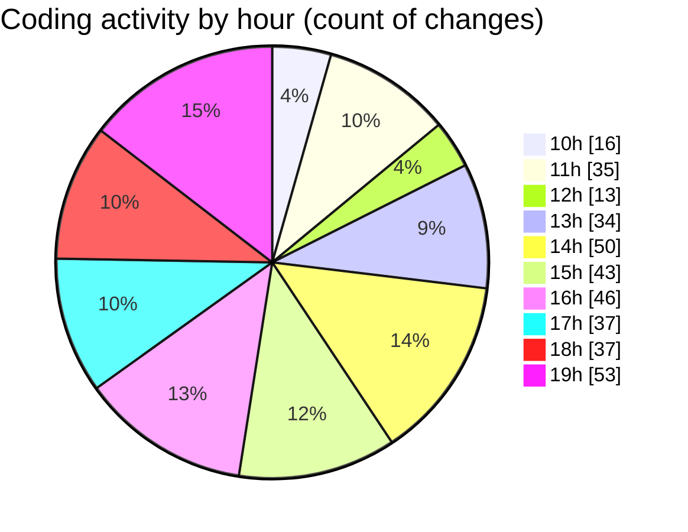

# MicrOS - Activity Summary 

## Overall Statistics

| Stat                   | Value                                                             |
| ---------------------- | ----------------------------------------------------------------- |
| **Lines Added** (➕)   | 18882                                          |
| **Lines Removed** (➖) | 1883                                        |
| **Net Change** (↕)    | 16999                |
| **Active Time** (⌚)   | 502 minutes |

## Modified Files
- **FileManager.java** (+1549, -7)
- **VirtualFileSystem.java** (+2433, -56)
- **BackgroundPanel.java** (+274, -0)
- **Main.java** (+683, -13)
- **FileContextMenuProvider.ts** (+33, -32)
- **FileExplorer.ts** (+23, -22)
- **settings.json** (+377, -0)
- **start.sh** (+8, -0)
- **.gitignore** (+41, -0)
- **main.masm** (+18, -0)
- **interp.java** (+6, -0)
- **instructions.java** (+6, -0)
- **common.java** (+6, -0)
- **AsmRunner.java** (+141, -34)
- **pom.xml** (+488, -40)
- **Console.java** (+960, -134)
- **CommandProcessor.java** (+1124, -94)
- **ConsoleTextEditor.java** (+182, -181)
- **NanoEditor.java** (+312, -311)
- **VimEditor.java** (+485, -484)
- **common.java** (+19, -18)
- **TextEditor.java** (+1206, -66)
- **LineNumberComponent.java** (+89, -0)
- **SyntaxHighlighter.java** (+443, -73)
- **Settings.java** (+420, -173)
- **WindowManager.java** (+2041, -63)
- **Taskbar.java** (+389, -58)
- **SettingsDialog.java** (+740, -2)
- **WebViewer.java** (+375, -0)
- **WrapLayout.java** (+186, -0)
- **TaskButton.java** (+300, -0)
- **StartMenu.java** (+219, -0)
- **ClockPanel.java** (+108, -0)
- **SystemTray.java** (+60, -0)
- **asm.json** (+27, -0)
- **java.json** (+27, -0)
- **html.json** (+26, -0)
- **AppManifest.java** (+108, -0)
- **AppLoader.java** (+272, -0)
- **MicrOSApp.java** (+40, -0)
- **ApplicationLauncher.java** (+304, -4)
- **DesktopIcon.java** (+45, -0)
- **FileMetadata.java** (+45, -0)
- **FileManager.java** (+304, -8)
- **FileManager.java** (+277, -0)
- **FileMetadata.java** (+45, -0)
- **Settings.java** (+170, -0)
- **Taskbar.java** (+236, -0)
- **FileManager.java** (+277, -0)
- **VirtualFileSystem.java** (+485, -0)
- **DesktopIcon.java** (+45, -2)
- **FileMetadata.java** (+45, -1)
- **MicrOSApp.java** (+20, -2)
- **AppManifest.java** (+54, -0)
- **AppLoader.java** (+136, -0)
- **ApplicationLauncher.java** (+150, -5)

## Visualizations

### By File Type (Lines Changed)

### By Hour (Estimated Activity Count)

> **Last Updated:** 20/02/2025, 19:29:00