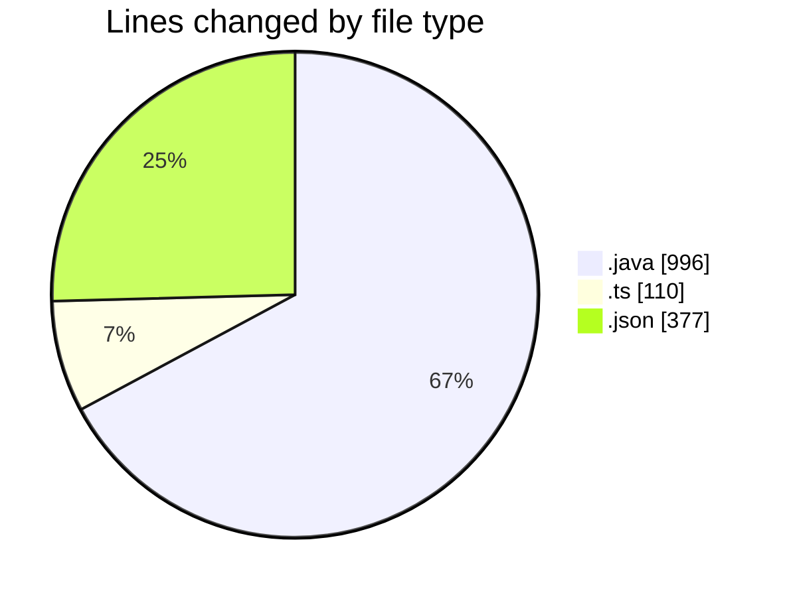
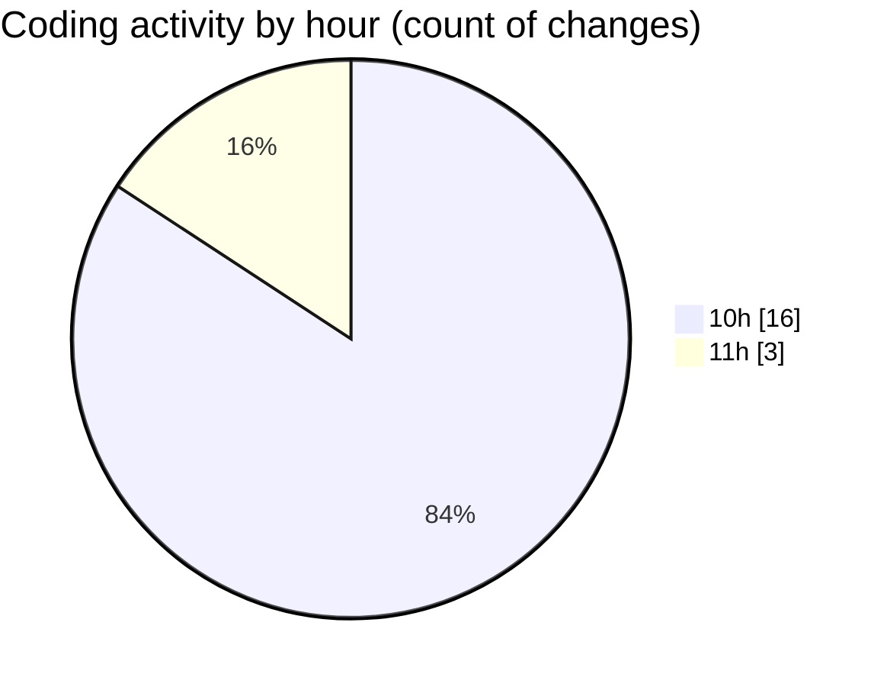

# MicrOS - Activity Summary 

## Overall Statistics

| Stat                   | Value                                                             |
| ---------------------- | ----------------------------------------------------------------- |
| **Lines Added** (➕)   | 1426                                          |
| **Lines Removed** (➖) | 57                                        |
| **Net Change** (↕)    | 1369                |
| **Active Time** (⌚)   | 28 minutes |

## Modified Files
- **FileManager.java** (+440, -0)
- **VirtualFileSystem.java** (+427, -3)
- **BackgroundPanel.java** (+31, -0)
- **Main.java** (+95, -0)
- **FileContextMenuProvider.ts** (+33, -32)
- **FileExplorer.ts** (+23, -22)
- **settings.json** (+377, -0)

## Visualizations

### By File Type (Lines Changed)

### By Hour (Estimated Activity Count)

> **Last Updated:** 20/02/2025, 11:13:37