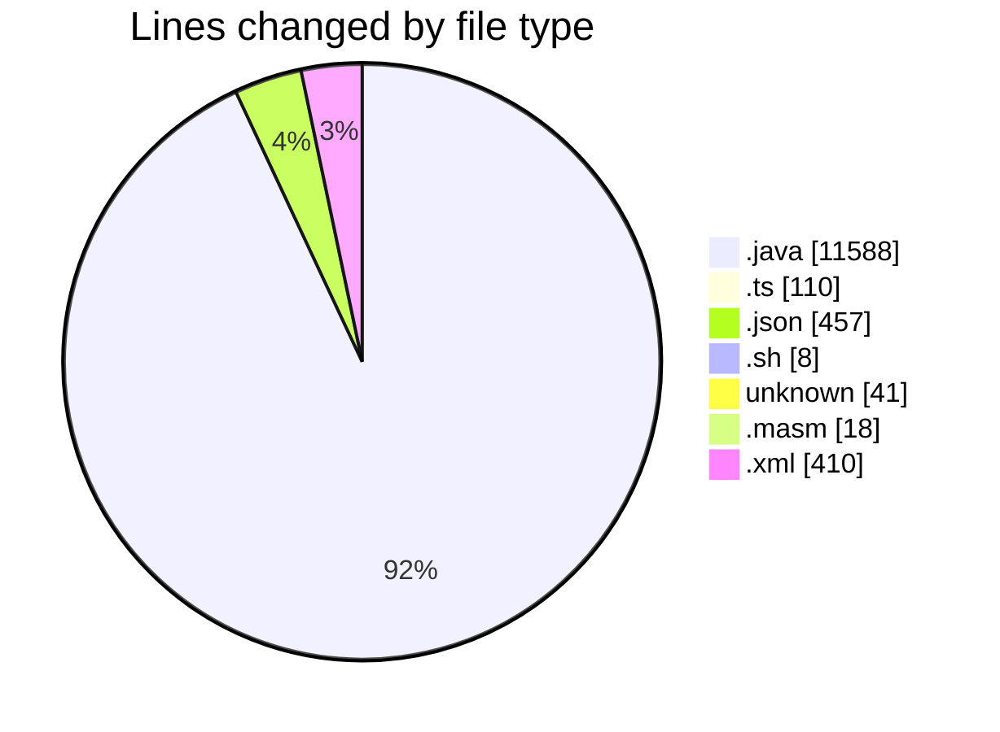
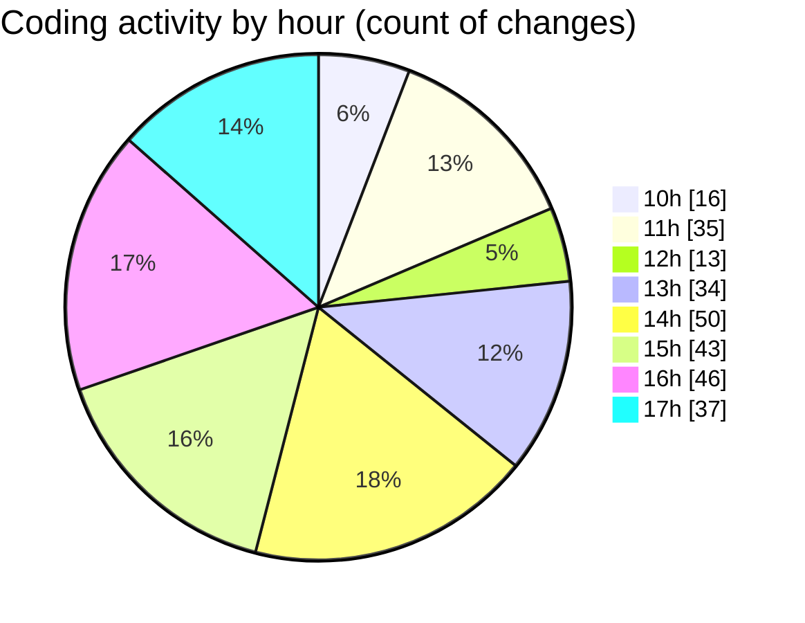

# MicrOS - Activity Summary 

## Overall Statistics

| Stat                   | Value                                                             |
| ---------------------- | ----------------------------------------------------------------- |
| **Lines Added** (➕)   | 10789                                          |
| **Lines Removed** (➖) | 1843                                        |
| **Net Change** (↕)    | 8946                |
| **Active Time** (⌚)   | 405 minutes |

## Modified Files
- **FileManager.java** (+995, -5)
- **VirtualFileSystem.java** (+1460, -55)
- **BackgroundPanel.java** (+193, -0)
- **Main.java** (+405, -11)
- **FileContextMenuProvider.ts** (+33, -32)
- **FileExplorer.ts** (+23, -22)
- **settings.json** (+377, -0)
- **start.sh** (+8, -0)
- **.gitignore** (+41, -0)
- **main.masm** (+18, -0)
- **interp.java** (+6, -0)
- **instructions.java** (+6, -0)
- **common.java** (+6, -0)
- **AsmRunner.java** (+141, -34)
- **pom.xml** (+370, -40)
- **Console.java** (+728, -134)
- **CommandProcessor.java** (+838, -94)
- **ConsoleTextEditor.java** (+182, -181)
- **NanoEditor.java** (+312, -311)
- **VimEditor.java** (+485, -484)
- **common.java** (+19, -18)
- **TextEditor.java** (+822, -66)
- **LineNumberComponent.java** (+89, -0)
- **SyntaxHighlighter.java** (+309, -73)
- **Settings.java** (+335, -171)
- **WindowManager.java** (+1039, -61)
- **Taskbar.java** (+271, -51)
- **SettingsDialog.java** (+366, -0)
- **WebViewer.java** (+250, -0)
- **WrapLayout.java** (+124, -0)
- **TaskButton.java** (+200, -0)
- **StartMenu.java** (+146, -0)
- **ClockPanel.java** (+72, -0)
- **SystemTray.java** (+40, -0)
- **asm.json** (+27, -0)
- **java.json** (+27, -0)
- **html.json** (+26, -0)

## Visualizations

### By File Type (Lines Changed)

### By Hour (Estimated Activity Count)

> **Last Updated:** 20/02/2025, 17:37:36