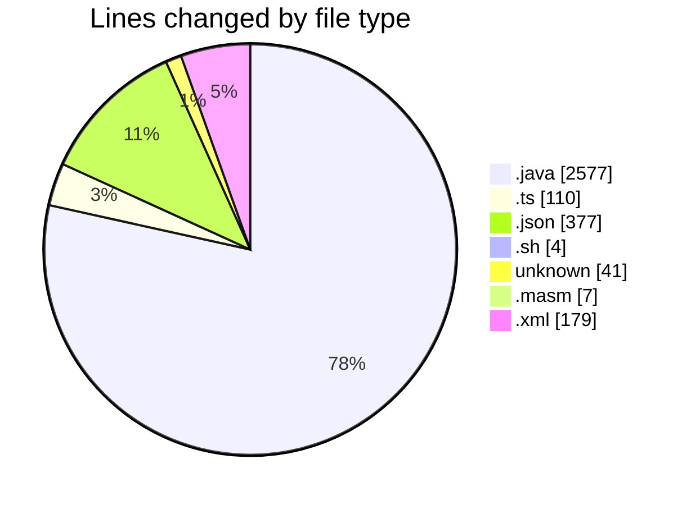
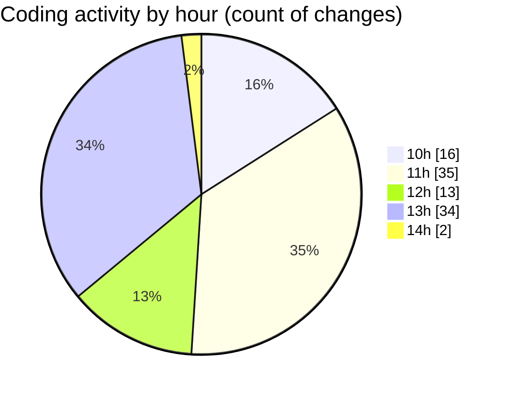

# MicrOS - Activity Summary 

## Overall Statistics

| Stat                   | Value                                                             |
| ---------------------- | ----------------------------------------------------------------- |
| **Lines Added** (➕)   | 2846                                          |
| **Lines Removed** (➖) | 449                                        |
| **Net Change** (↕)    | 2397                |
| **Active Time** (⌚)   | 125 minutes |

## Modified Files
- **FileManager.java** (+445, -5)
- **VirtualFileSystem.java** (+513, -47)
- **BackgroundPanel.java** (+31, -0)
- **Main.java** (+104, -4)
- **FileContextMenuProvider.ts** (+33, -32)
- **FileExplorer.ts** (+23, -22)
- **settings.json** (+377, -0)
- **start.sh** (+4, -0)
- **.gitignore** (+41, -0)
- **main.masm** (+7, -0)
- **interp.java** (+6, -0)
- **instructions.java** (+6, -0)
- **common.java** (+6, -0)
- **AsmRunner.java** (+54, -9)
- **pom.xml** (+139, -40)
- **Console.java** (+315, -97)
- **CommandProcessor.java** (+250, -10)
- **ConsoleTextEditor.java** (+182, -181)
- **NanoEditor.java** (+310, -2)

## Visualizations

### By File Type (Lines Changed)

### By Hour (Estimated Activity Count)

> **Last Updated:** 20/02/2025, 14:02:20