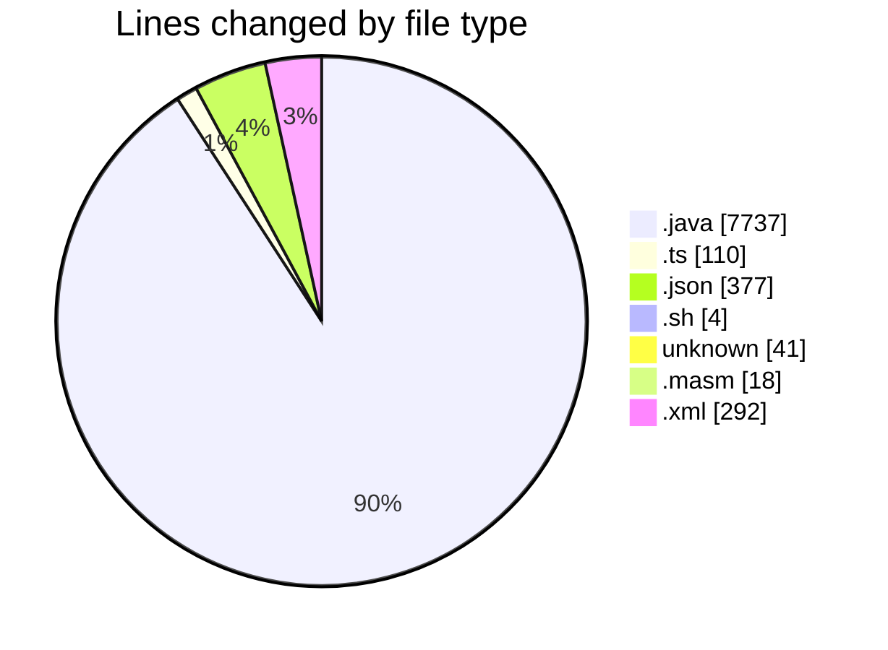
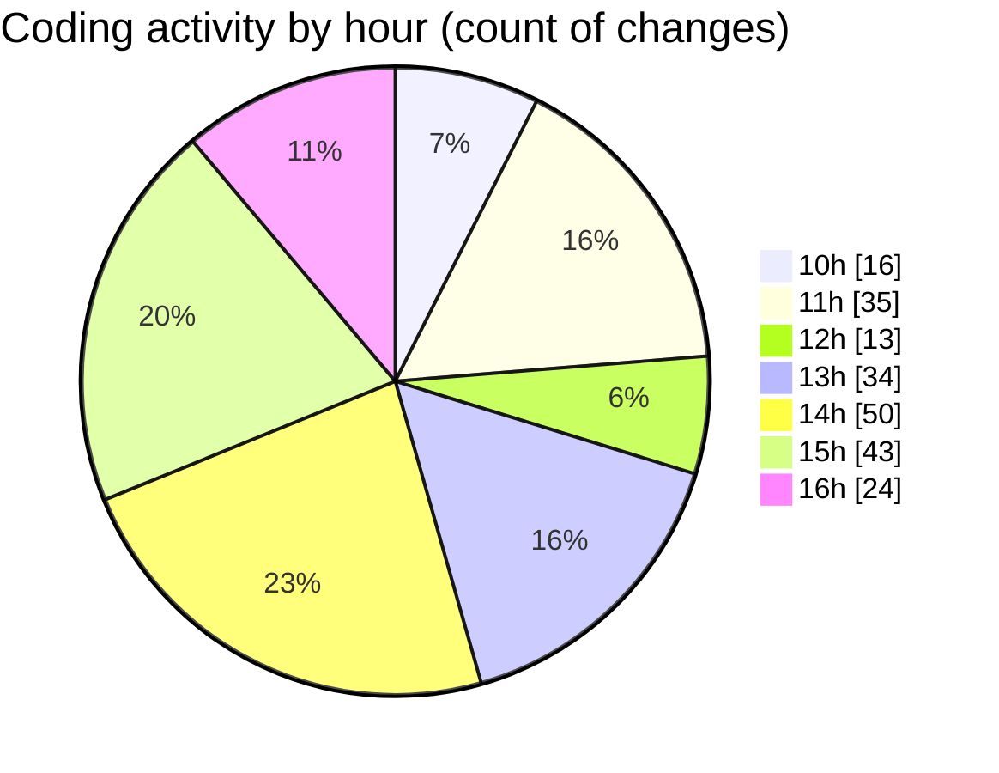

# MicrOS - Activity Summary 

## Overall Statistics

| Stat                   | Value                                                             |
| ---------------------- | ----------------------------------------------------------------- |
| **Lines Added** (➕)   | 6798                                          |
| **Lines Removed** (➖) | 1781                                        |
| **Net Change** (↕)    | 5017                |
| **Active Time** (⌚)   | 298 minutes |

## Modified Files
- **FileManager.java** (+720, -5)
- **VirtualFileSystem.java** (+987, -55)
- **BackgroundPanel.java** (+62, -0)
- **Main.java** (+269, -11)
- **FileContextMenuProvider.ts** (+33, -32)
- **FileExplorer.ts** (+23, -22)
- **settings.json** (+377, -0)
- **start.sh** (+4, -0)
- **.gitignore** (+41, -0)
- **main.masm** (+18, -0)
- **interp.java** (+6, -0)
- **instructions.java** (+6, -0)
- **common.java** (+6, -0)
- **AsmRunner.java** (+141, -34)
- **pom.xml** (+252, -40)
- **Console.java** (+496, -134)
- **CommandProcessor.java** (+552, -94)
- **ConsoleTextEditor.java** (+182, -181)
- **NanoEditor.java** (+312, -311)
- **VimEditor.java** (+485, -484)
- **common.java** (+19, -18)
- **TextEditor.java** (+438, -66)
- **LineNumberComponent.java** (+89, -0)
- **SyntaxHighlighter.java** (+171, -69)
- **Settings.java** (+253, -171)
- **WindowManager.java** (+512, -48)
- **Taskbar.java** (+86, -6)
- **SettingsDialog.java** (+133, -0)
- **WebViewer.java** (+125, -0)

## Visualizations

### By File Type (Lines Changed)

### By Hour (Estimated Activity Count)

> **Last Updated:** 20/02/2025, 16:35:36