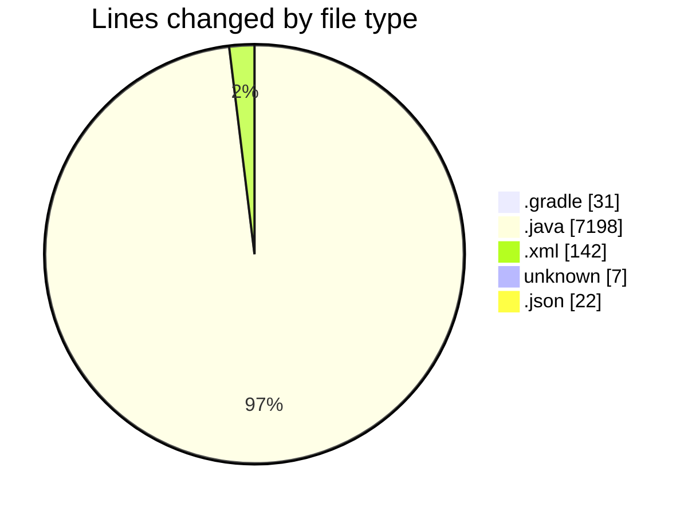
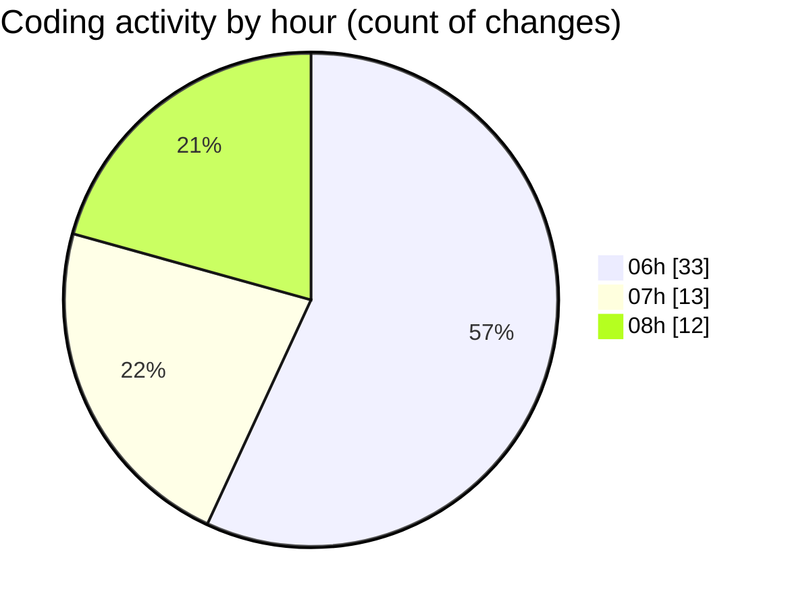

# MicrOS - Activity Summary 

## Overall Statistics

| Stat                   | Value                                                             |
| ---------------------- | ----------------------------------------------------------------- |
| **Lines Added** (➕)   | 7125                                          |
| **Lines Removed** (➖) | 275                                        |
| **Net Change** (↕)    | 6850                |
| **Active Time** (⌚)   | 88 minutes |

## Modified Files
- **build.gradle** (+31, -0)
- **BackgroundPanel.java** (+83, -0)
- **Console.java** (+236, -0)
- **WindowManager.java** (+504, -0)
- **ClockPanel.java** (+36, -0)
- **TextEditor.java** (+387, -0)
- **StartMenu.java** (+76, -0)
- **CommandProcessor.java** (+289, -0)
- **SettingsDialog.java** (+188, -0)
- **SyntaxHighlighter.java** (+136, -0)
- **TaskButton.java** (+100, -0)
- **WebViewer.java** (+128, -0)
- **VirtualFileSystem.java** (+488, -0)
- **WrapLayout.java** (+62, -0)
- **SystemTray.java** (+20, -0)
- **WindowManager.java** (+1050, -39)
- **TextEditorApp.java** (+144, -29)
- **ApplicationLauncher.java** (+302, -0)
- **StartMenu.java** (+108, -3)
- **SettingsDialog.java** (+323, -177)
- **Main.java** (+183, -0)
- **Console.java** (+235, -1)
- **VirtualFileSystem.java** (+488, -0)
- **VirtualFileSystem.java** (+488, -0)
- **Console.java** (+236, -0)
- **pom.xml** (+116, -26)
- **.gitignore** (+7, -0)
- **TextEditorPanel.java** (+389, -0)
- **SyntaxHighlighter.java** (+42, -0)
- **LineNumberComponent.java** (+89, -0)
- **manifest.json** (+22, -0)
- **AppLoader.java** (+139, -0)

## Visualizations

### By File Type (Lines Changed)

### By Hour (Estimated Activity Count)

> **Last Updated:** 21/02/2025, 08:29:10