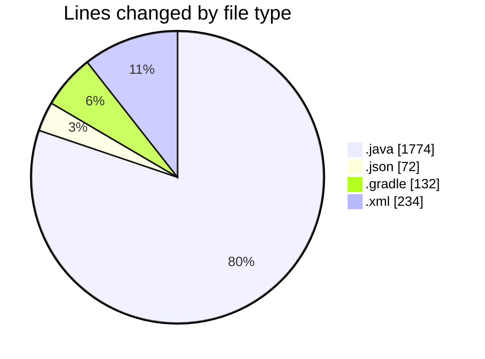
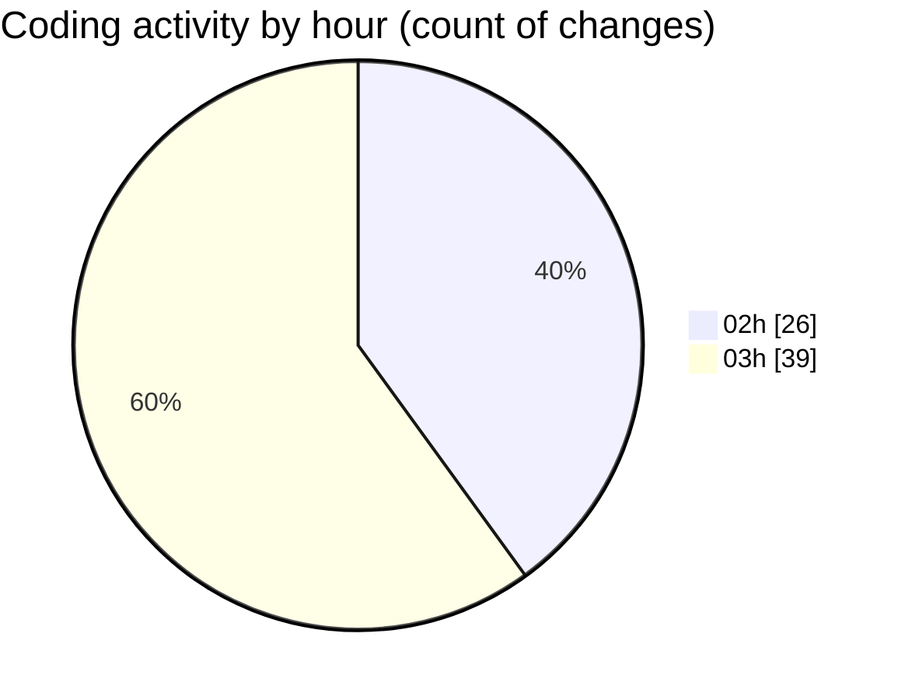

# MicrOS - Activity Summary 

## Overall Statistics

| Stat                   | Value                                                             |
| ---------------------- | ----------------------------------------------------------------- |
| **Lines Added** (➕)   | 1512                                          |
| **Lines Removed** (➖) | 700                                        |
| **Net Change** (↕)    | 812                |
| **Active Time** (⌚)   | 79 minutes |

## Modified Files
- **FileManager.java** (+210, -5)
- **AssemblyInterface.java** (+9, -1)
- **WindowManager.java** (+392, -391)
- **settings.json** (+72, -0)
- **Taskbar.java** (+72, -0)
- **AsmRunner.java** (+38, -0)
- **Main.java** (+307, -160)
- **Settings.java** (+105, -0)
- **AndroidInitializer.java** (+51, -33)
- **build.gradle** (+65, -64)
- **pom.xml** (+189, -45)
- **settings.gradle** (+2, -1)

## Visualizations

### By File Type (Lines Changed)

### By Hour (Estimated Activity Count)

> **Last Updated:** 2/22/2025, 3:41:19 AM