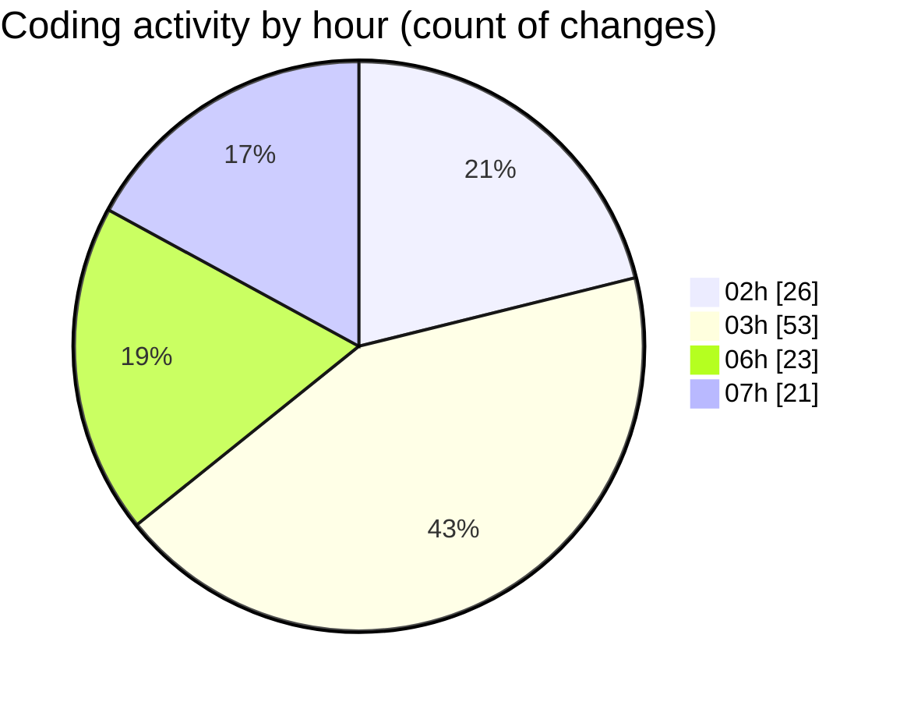

# MicrOS - Activity Summary 

## Overall Statistics

| Stat                   | Value                                                             |
| ---------------------- | ----------------------------------------------------------------- |
| **Lines Added** (➕)   | 4840                                          |
| **Lines Removed** (➖) | 713                                        |
| **Net Change** (↕)    | 4127                |
| **Active Time** (⌚)   | 150 minutes |

## Modified Files
- **d:\MicrOS\src\main\java\org\Finite\MicrOS\FileManager.java** (+210, -5)
- **d:\MicrOS\src\main\java\org\Finite\MicrOS\AssemblyInterface.java** (+9, -1)
- **d:\MicrOS\src\main\java\org\Finite\MicrOS\WindowManager.java** (+392, -391)
- **c:\Users\GAMER\AppData\Roaming\Code - Insiders\User\profiles\-25067dec\settings.json** (+72, -0)
- **d:\MicrOS\src\main\java\org\Finite\MicrOS\Taskbar.java** (+72, -0)
- **d:\MicrOS\src\main\java\org\Finite\MicrOS\AsmRunner.java** (+38, -0)
- **d:\MicrOS\src\main\java\org\Finite\MicrOS\Main.java** (+307, -160)
- **d:\MicrOS\src\main\java\org\Finite\MicrOS\Desktop\Settings.java** (+105, -0)
- **d:\MicrOS\src\main\java\org\Finite\MicrOS\Android\AndroidInitializer.java** (+51, -33)
- **d:\MicrOS\build.gradle** (+65, -64)
- **d:\MicrOS\pom.xml** (+224, -45)
- **d:\MicrOS\settings.gradle** (+2, -1)
- **d:\MicrOS\android-project\settings.gradle** (+2, -0)
- **d:\MicrOS\android-project\build.gradle** (+17, -0)
- **d:\MicrOS\android-project\app\build.gradle** (+23, -0)
- **d:\MicrOS\android-project\app\src\main\AndroidManifest.xml** (+20, -0)
- **d:\MicrOS\android-project\app\src\main\java\com\example\micros\MainActivity.java** (+16, -0)
- **d:\MicrOS\apps\Monster\dependency-reduced-pom.xml** (+72, -0)
- **d:\MicrOS\apps\Monster\pom.xml** (+90, -0)
- **Taskbar.java** (+175, -0)
- **StartMenu.java** (+128, -0)
- **Main.java** (+276, -0)
- **StartMenu.java** (+106, -0)
- **FontLoader.java** (+47, -0)
- **ErrorDialog.java** (+139, -0)
- **TaskButton.java** (+148, -0)
- **AppManifest.java** (+71, -0)
- **AppType.java** (+38, -0)
- **pom.xml** (+111, -0)
- **MicrOSApp.java** (+54, -0)
- **WindowManager.java** (+663, -0)
- **MaverLauncher.java** (+200, -0)
- **manifest.json** (+22, -0)
- **NativeWindow.java** (+1, -0)
- **NativeProcessWindow.java** (+76, -0)
- **ProcessManager.java** (+272, -13)
- **ApplicationLauncher.java** (+161, -0)
- **pom.xml** (+223, -0)
- **GLWindow.java** (+142, -0)

## Visualizations

### By File Type (Lines Changed)

### By Hour (Estimated Activity Count)

> **Last Updated:** 22/02/2025, 07:22:31