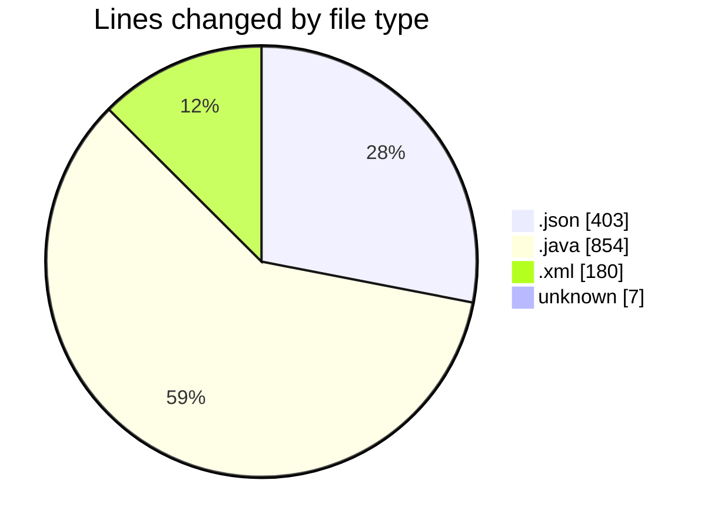
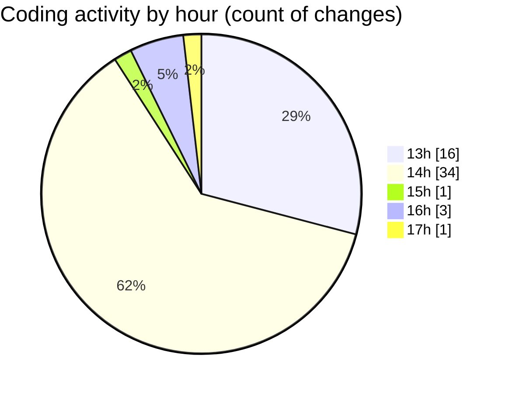

# CodePack - Activity Summary 

## Overall Statistics

| Stat                   | Value                                                             |
| ---------------------- | ----------------------------------------------------------------- |
| **Lines Added** (➕)   | 1133                                          |
| **Lines Removed** (➖) | 311                                        |
| **Net Change** (↕)    | 822                |
| **Active Time** (⌚)   | 69 minutes |

## Modified Files
- **manifest.json** (+22, -0)
- **DemoApp.java** (+389, -213)
- **Main.java** (+158, -94)
- **pom.xml** (+104, -4)
- **dependency-reduced-pom.xml** (+72, -0)
- **settings.json** (+3, -0)
- **.gitignore** (+7, -0)
- **settings.json** (+378, -0)

## Visualizations

### By File Type (Lines Changed)

### By Hour (Estimated Activity Count)

> **Last Updated:** 23/02/2025, 18:00:46