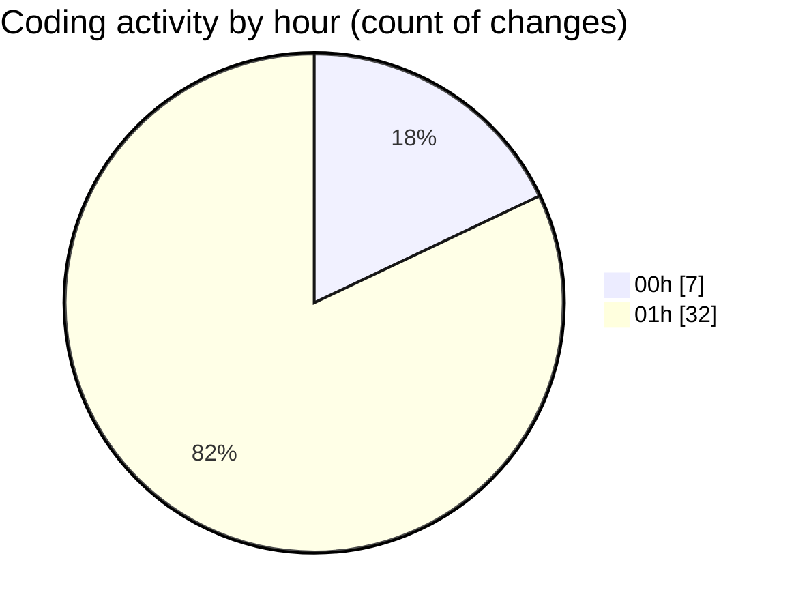

# MicrOS - Activity Summary 

## Overall Statistics

| Stat                   | Value                                                             |
| ---------------------- | ----------------------------------------------------------------- |
| **Lines Added** (➕)   | 1711                                          |
| **Lines Removed** (➖) | 64                                        |
| **Net Change** (↕)    | 1647                |
| **Active Time** (⌚)   | 53 minutes |

## Modified Files
- **ProcessManager.java** (+289, -25)
- **MicrOSApp.java** (+80, -0)
- **WindowManager.java** (+738, -26)
- **AppLoader.java** (+175, -7)
- **AppManifest.java** (+80, -0)
- **DemoApp.java** (+81, -5)
- **Konsole.java** (+76, -0)
- **SettingsDialog.java** (+192, -1)

## Visualizations

### By File Type (Lines Changed)

### By Hour (Estimated Activity Count)

> **Last Updated:** 23/02/2025, 01:46:30