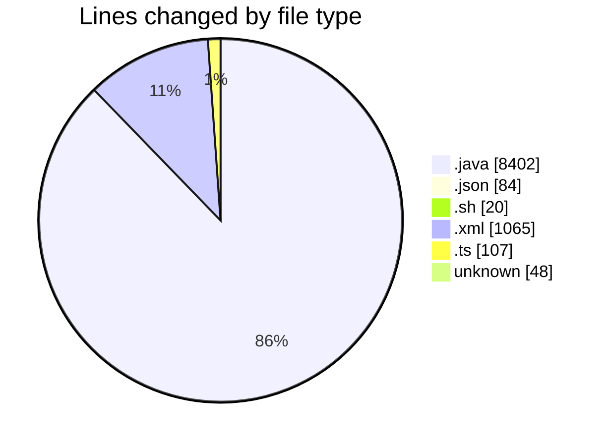
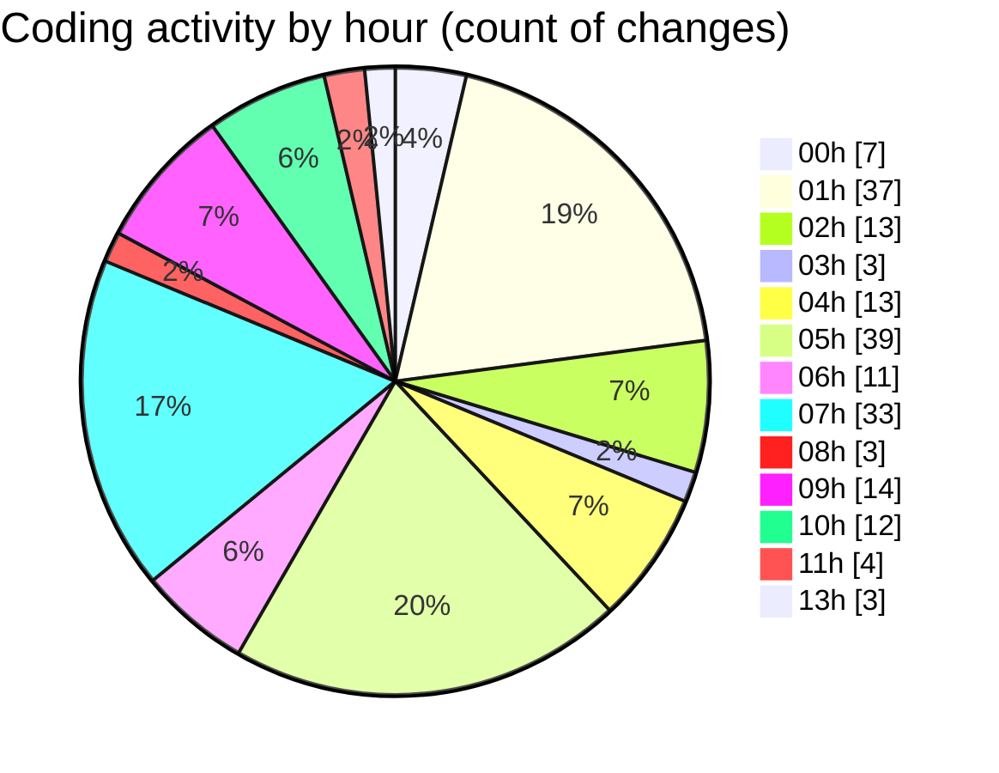

# MicrOS - Activity Summary 

## Overall Statistics

| Stat                   | Value                                                             |
| ---------------------- | ----------------------------------------------------------------- |
| **Lines Added** (➕)   | 8287                                          |
| **Lines Removed** (➖) | 1439                                        |
| **Net Change** (↕)    | 6848                |
| **Active Time** (⌚)   | 271 minutes |

## Modified Files
- **ProcessManager.java** (+596, -25)
- **MicrOSApp.java** (+175, -0)
- **WindowManager.java** (+1494, -26)
- **AppLoader.java** (+449, -7)
- **AppManifest.java** (+170, -0)
- **DemoApp.java** (+81, -5)
- **Konsole.java** (+76, -0)
- **SettingsDialog.java** (+192, -1)
- **LaunchOptions.java** (+47, -0)
- **Main.java** (+1826, -678)
- **manifest.json** (+22, -0)
- **manifest.json** (+44, -1)
- **Konsole.java** (+76, -0)
- **start.1.sh** (+4, -0)
- **testkonsole.sh** (+4, -0)
- **konsole.sh** (+10, -2)
- **pom.xml** (+90, -0)
- **MainClass.java** (+4, -0)
- **MainC.java** (+45, -0)
- **DemoApp.java** (+45, -0)
- **Main.java** (+485, -203)
- **MessageBus.java** (+30, -0)
- **Registry.java** (+26, -0)
- **Intent.java** (+30, -0)
- **FileWatcher.java** (+49, -0)
- **CLIRegistry.java** (+56, -0)
- **manifest.json** (+17, -0)
- **Main.java** (+67, -0)
- **ErrorDialog.java** (+48, -0)
- **SplashScreen.java** (+402, -144)
- **history.ts** (+54, -53)
- **StartMenu.java** (+107, -0)
- **StartMenu.java** (+132, -0)
- **pom.xml** (+687, -288)
- **.gitignore** (+41, -0)
- **Taskbar.java** (+188, -0)
- **TaskButton.java** (+164, -0)
- **Main.java** (+247, -6)
- **.gitignore** (+7, -0)

## Visualizations

### By File Type (Lines Changed)

### By Hour (Estimated Activity Count)

> **Last Updated:** 23/02/2025, 13:49:55