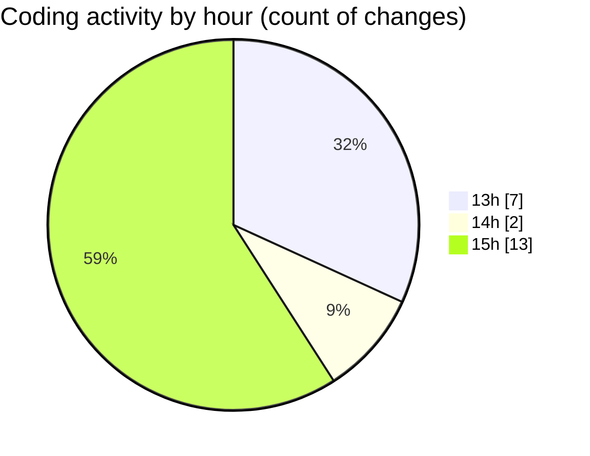

# MicrOS - Activity Summary 

## Overall Statistics

| Stat                   | Value                                                             |
| ---------------------- | ----------------------------------------------------------------- |
| **Lines Added** (➕)   | 2306                                          |
| **Lines Removed** (➖) | 100                                        |
| **Net Change** (↕)    | 2206                |
| **Active Time** (⌚)   | 18 minutes |

## Modified Files
- **COMMIT_EDITMSG** (+85, -83)
- **pom.xml** (+399, -0)
- **MicrOSApp.java** (+99, -0)
- **WindowManager.java** (+742, -3)
- **AppInstaller.java** (+126, -0)
- **AppType.java** (+43, -4)
- **FileManager.java** (+317, -6)
- **Main.java** (+495, -4)

## Visualizations

### By File Type (Lines Changed)

### By Hour (Estimated Activity Count)

> **Last Updated:** 24/02/2025, 15:53:50