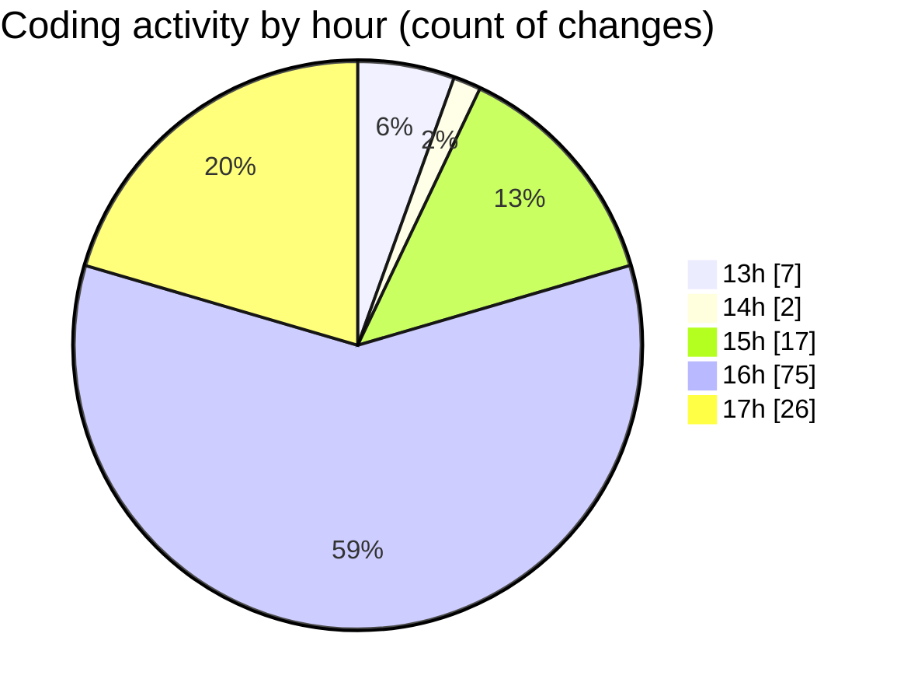

# MicrOS - Activity Summary 

## Overall Statistics

| Stat                   | Value                                                             |
| ---------------------- | ----------------------------------------------------------------- |
| **Lines Added** (➕)   | 4982                                          |
| **Lines Removed** (➖) | 956                                        |
| **Net Change** (↕)    | 4026                |
| **Active Time** (⌚)   | 177 minutes |

## Modified Files
- **COMMIT_EDITMSG** (+85, -83)
- **pom.xml** (+399, -0)
- **MicrOSApp.java** (+99, -0)
- **WindowManager.java** (+1740, -259)
- **AppInstaller.java** (+139, -9)
- **AppType.java** (+48, -10)
- **FileManager.java** (+381, -100)
- **Main.java** (+603, -42)
- **AppPackager.java** (+270, -269)
- **invoke>** (+3, -0)
- **AppLoader.java** (+10, -0)
- **settings.json** (+387, -2)
- **Taskbar.java** (+200, -12)
- **TaskButton.java** (+228, -64)
- **AppLoader.java** (+348, -105)
- **.gitignore** (+42, -1)

## Visualizations

### By File Type (Lines Changed)

### By Hour (Estimated Activity Count)

> **Last Updated:** 24/02/2025, 17:33:51