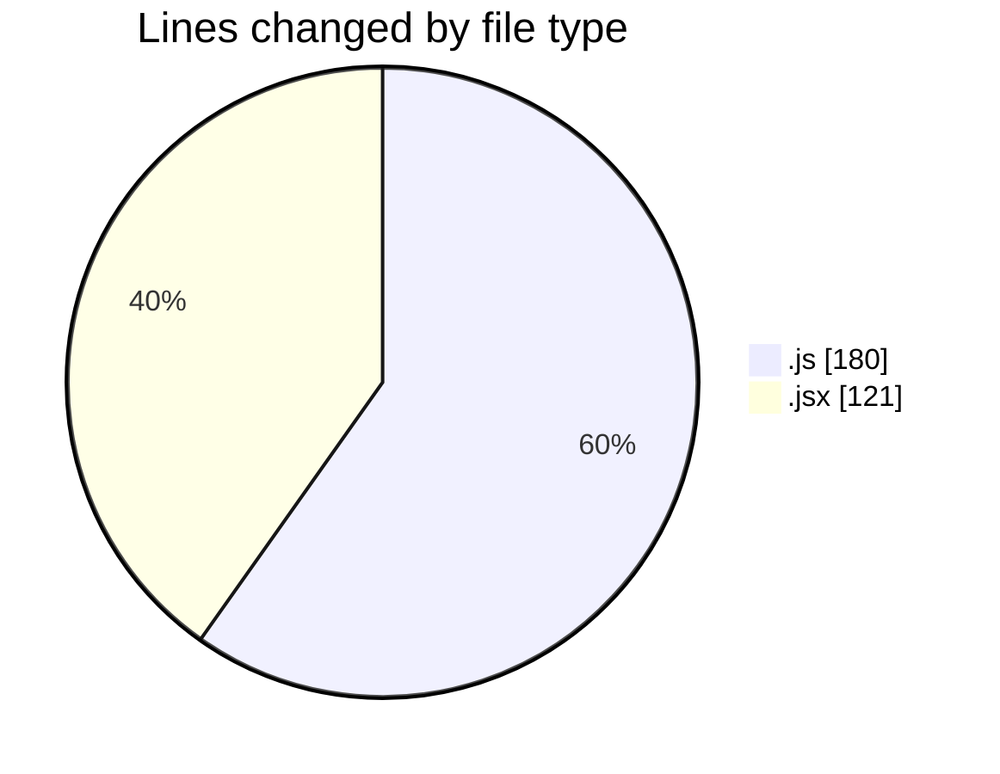

# finite.vercel.app - Activity Summary 

## Overall Statistics

| Stat                   | Value                                                             |
| ---------------------- | ----------------------------------------------------------------- |
| **Lines Added** (➕)   | 295                                          |
| **Lines Removed** (➖) | 6                                        |
| **Net Change** (↕)    | 289                |
| **Active Time** (⌚)   | 12 minutes |

## Modified Files
- **data.js** (+174, -6)
- **masm.jsx** (+121, -0)

## Visualizations

### By File Type (Lines Changed)

### By Hour (Estimated Activity Count)

> **Last Updated:** 25/02/2025, 07:23:13