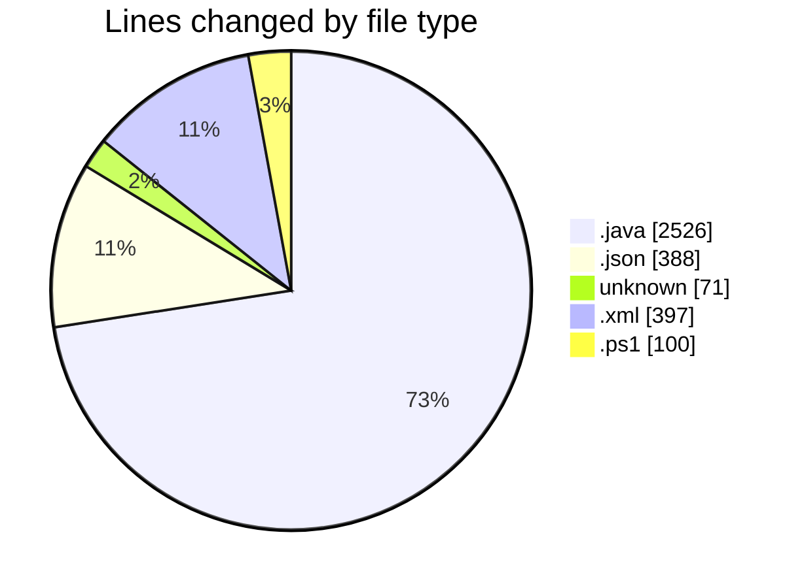
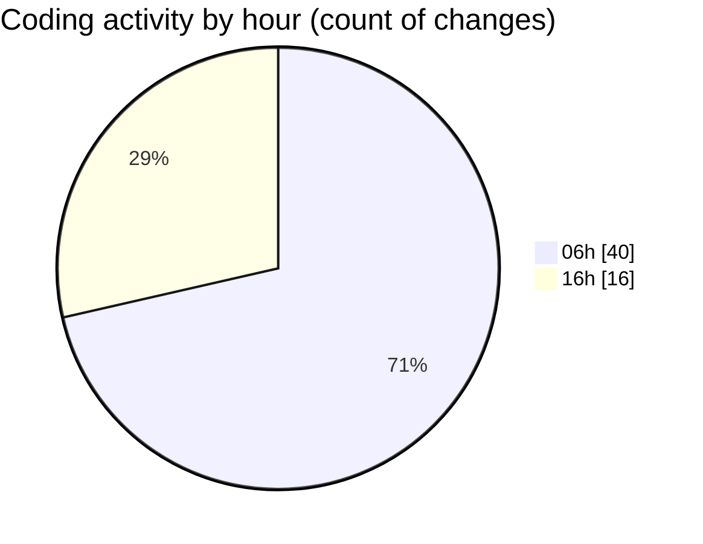

# MicrOS - Activity Summary 

## Overall Statistics

| Stat                   | Value                                                             |
| ---------------------- | ----------------------------------------------------------------- |
| **Lines Added** (➕)   | 3248                                          |
| **Lines Removed** (➖) | 234                                        |
| **Net Change** (↕)    | 3014                |
| **Active Time** (⌚)   | 74 minutes |

## Modified Files
- **FileManager.java** (+435, -69)
- **settings.json** (+387, -1)
- **VirtualFileSystem.java** (+494, -0)
- **.gitignore** (+61, -0)
- **.gitmodules** (+7, -3)
- **pom.xml** (+348, -49)
- **build.ps1** (+100, -0)
- **AndroidInitializer.java** (+18, -17)
- **Main.java** (+850, -65)
- **StartMenu.java** (+107, -0)
- **Taskbar.java** (+243, -25)
- **TaskButton.java** (+198, -5)

## Visualizations

### By File Type (Lines Changed)

### By Hour (Estimated Activity Count)

> **Last Updated:** 25/02/2025, 16:27:45