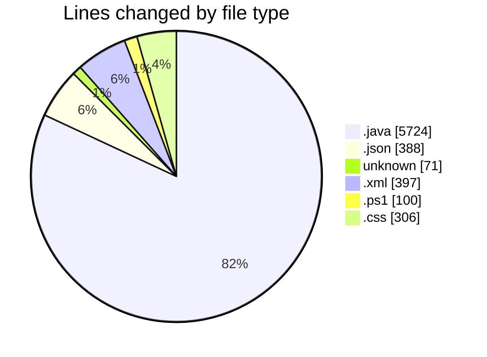
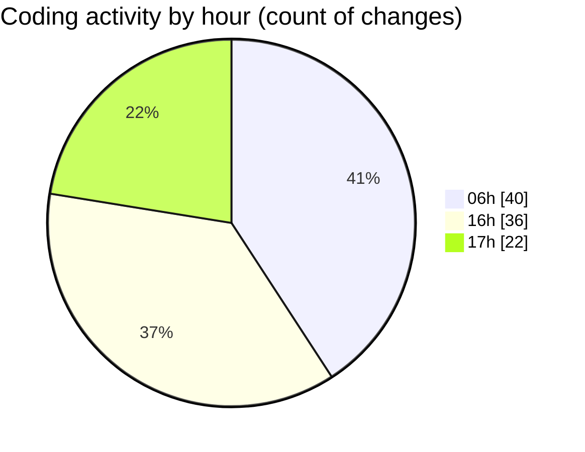

# MicrOS - Activity Summary 

## Overall Statistics

| Stat                   | Value                                                             |
| ---------------------- | ----------------------------------------------------------------- |
| **Lines Added** (➕)   | 5768                                          |
| **Lines Removed** (➖) | 1218                                        |
| **Net Change** (↕)    | 4550                |
| **Active Time** (⌚)   | 119 minutes |

## Modified Files
- **FileManager.java** (+435, -69)
- **settings.json** (+387, -1)
- **VirtualFileSystem.java** (+494, -0)
- **.gitignore** (+61, -0)
- **.gitmodules** (+7, -3)
- **pom.xml** (+348, -49)
- **build.ps1** (+100, -0)
- **AndroidInitializer.java** (+18, -17)
- **Main.java** (+1093, -308)
- **StartMenu.java** (+107, -0)
- **Taskbar.java** (+273, -55)
- **TaskButton.java** (+227, -34)
- **AppLoader.java** (+243, -104)
- **ErrorDialog.java** (+48, -7)
- **JavaFXPanel.java** (+54, -0)
- **JavaFXApp.java** (+36, -0)
- **WindowManager.java** (+808, -4)
- **TextEditorFX.java** (+73, -0)
- **HybridDemoApp.java** (+82, -0)
- **JavaFXAppTemplate.java** (+58, -0)
- **javafx-dark.css** (+155, -0)
- **JavaFXTheme.java** (+49, -0)
- **AppType.java** (+38, -0)
- **StartMenuFX.java** (+115, -114)
- **TaskbarFX.java** (+134, -133)
- **TaskButtonFX.java** (+101, -100)
- **ClockPanelFX.java** (+31, -30)
- **SystemTrayFX.java** (+38, -37)
- **DesktopFX.java** (+79, -78)
- **javafx-desktop.css** (+76, -75)

## Visualizations

### By File Type (Lines Changed)

### By Hour (Estimated Activity Count)

> **Last Updated:** 25/02/2025, 17:42:46