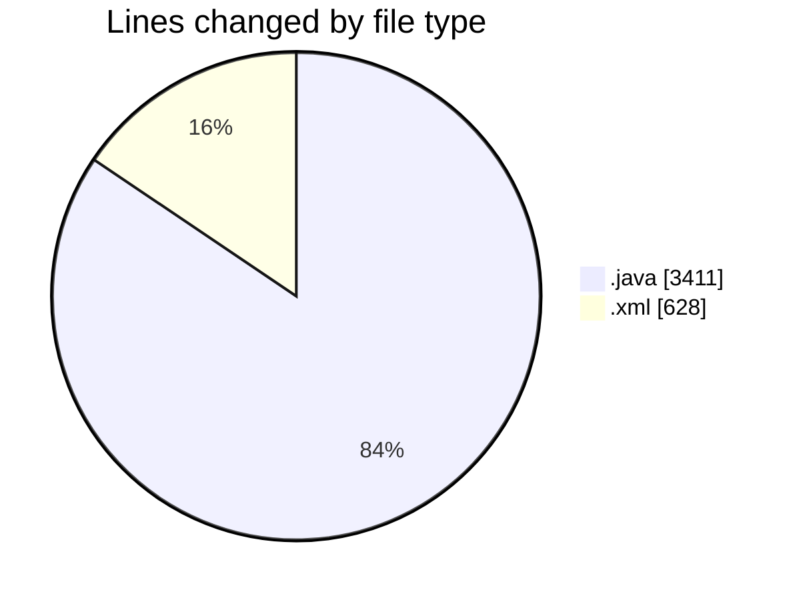
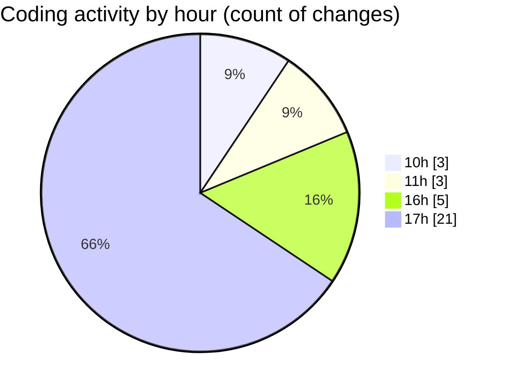

# MicrOS - Activity Summary 

## Overall Statistics

| Stat                   | Value                                                             |
| ---------------------- | ----------------------------------------------------------------- |
| **Lines Added** (➕)   | 3956                                          |
| **Lines Removed** (➖) | 83                                        |
| **Net Change** (↕)    | 3873                |
| **Active Time** (⌚)   | 47 minutes |

## Modified Files
- **Main.java** (+647, -76)
- **pom.xml** (+627, -1)
- **SplashScreen.java** (+238, -0)
- **AppInstaller.java** (+154, -2)
- **FileManager.java** (+446, -0)
- **FileManagerFX.java** (+514, -0)
- **WindowManager.java** (+1128, -4)
- **AppLoader.java** (+166, -0)
- **JavaFXApp.java** (+36, -0)

## Visualizations

### By File Type (Lines Changed)

### By Hour (Estimated Activity Count)

> **Last Updated:** 26/02/2025, 17:28:46