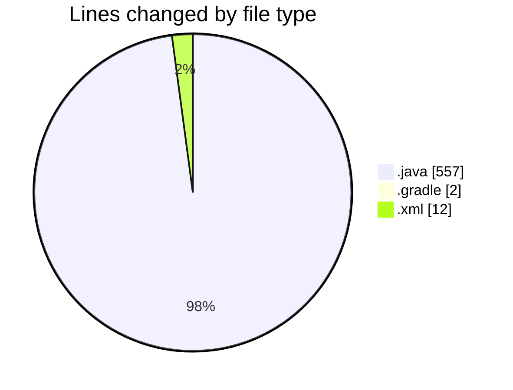
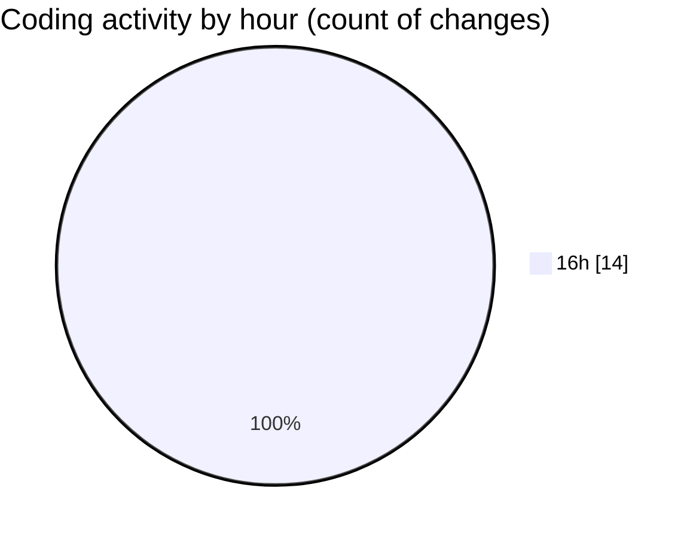

# Konsole - Activity Summary 

## Overall Statistics

| Stat                   | Value                                                             |
| ---------------------- | ----------------------------------------------------------------- |
| **Lines Added** (➕)   | 564                                          |
| **Lines Removed** (➖) | 7                                        |
| **Net Change** (↕)    | 557                |
| **Active Time** (⌚)   | 14 minutes |

## Modified Files
- **Konsole.java** (+233, -0)
- **Commands.java** (+75, -0)
- **Commmon.java** (+40, -0)
- **Theme.java** (+51, -0)
- **ThemeManager.java** (+156, -2)
- **build.gradle** (+2, -0)
- **pom.xml** (+7, -5)

## Visualizations

### By File Type (Lines Changed)

### By Hour (Estimated Activity Count)

> **Last Updated:** 27/02/2025, 16:41:29