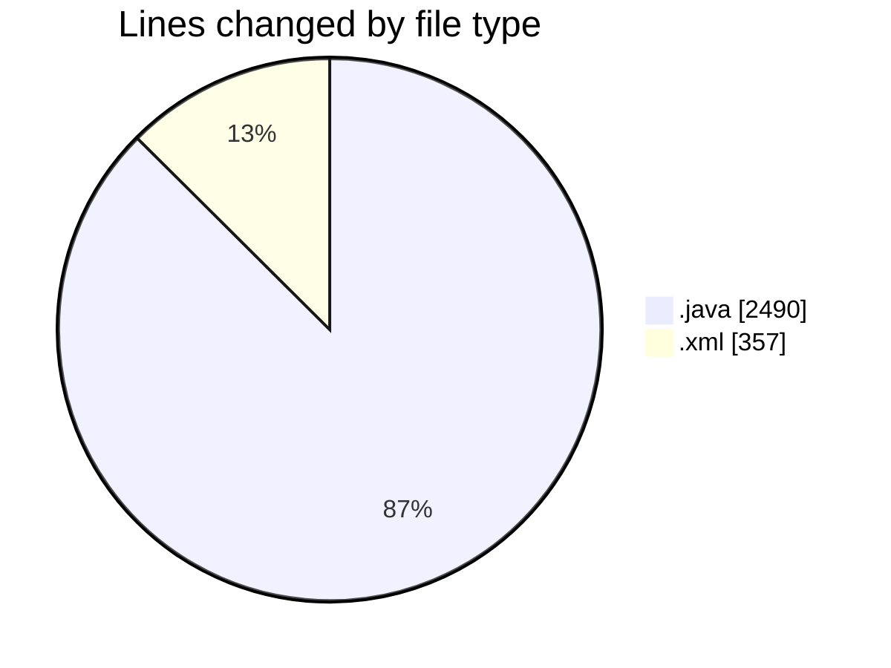
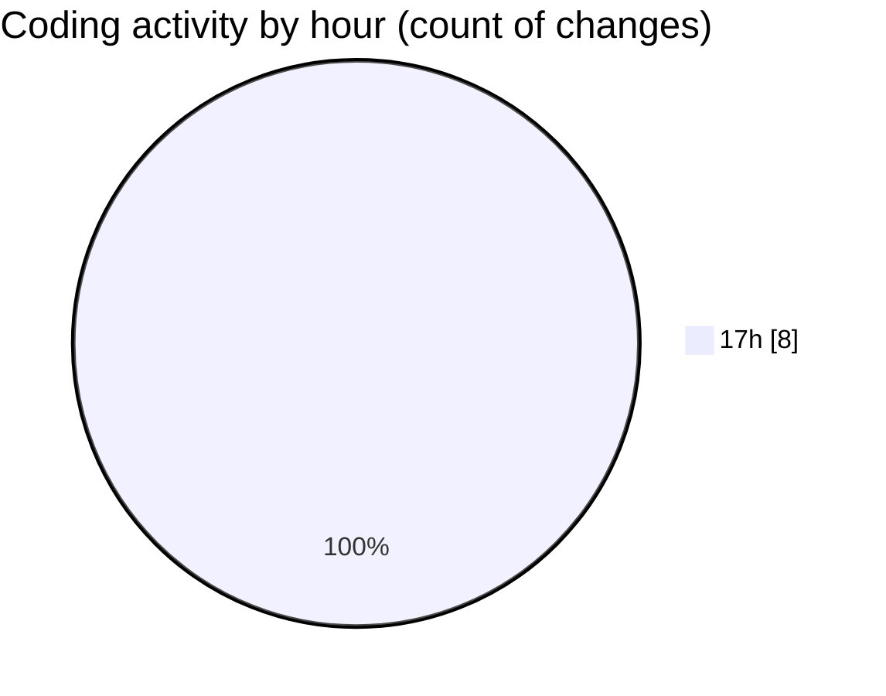

# MASM - Activity Summary 

## Overall Statistics

| Stat                   | Value                                                             |
| ---------------------- | ----------------------------------------------------------------- |
| **Lines Added** (➕)   | 2847                                          |
| **Lines Removed** (➖) | 0                                        |
| **Net Change** (↕)    | 2847                |
| **Active Time** (⌚)   | 0 minute |

## Modified Files
- **Functions.java** (+966, -0)
- **IO.java** (+37, -0)
- **FunctionsTest.java** (+483, -0)
- **MNIMethodObject.java** (+195, -0)
- **interp.java** (+589, -0)
- **ModuleInit.java** (+139, -0)
- **Main.java** (+81, -0)
- **pom.xml** (+357, -0)

## Visualizations

### By File Type (Lines Changed)

### By Hour (Estimated Activity Count)

> **Last Updated:** 08/03/2025, 17:23:25