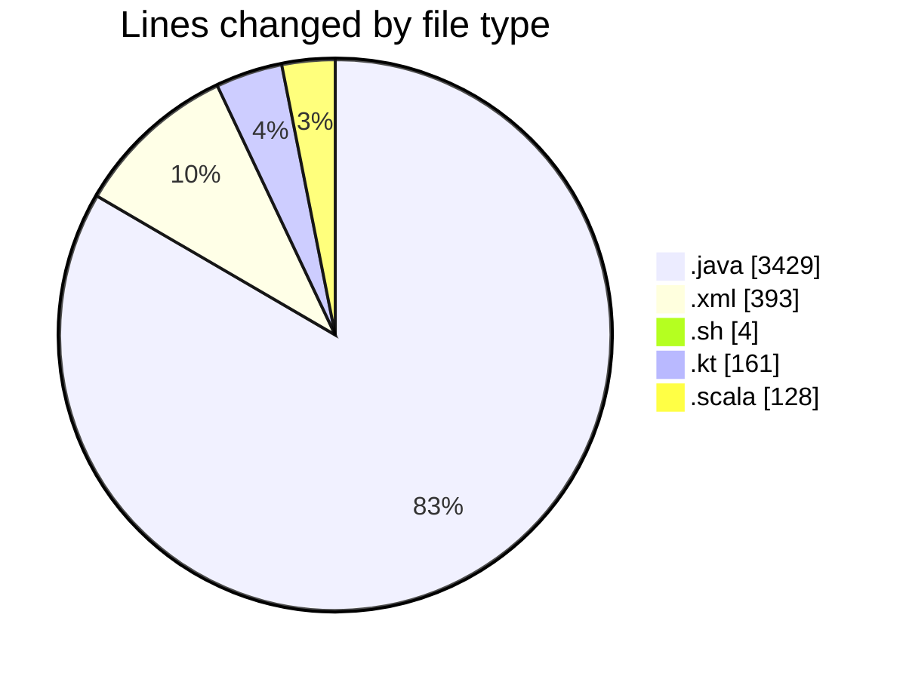
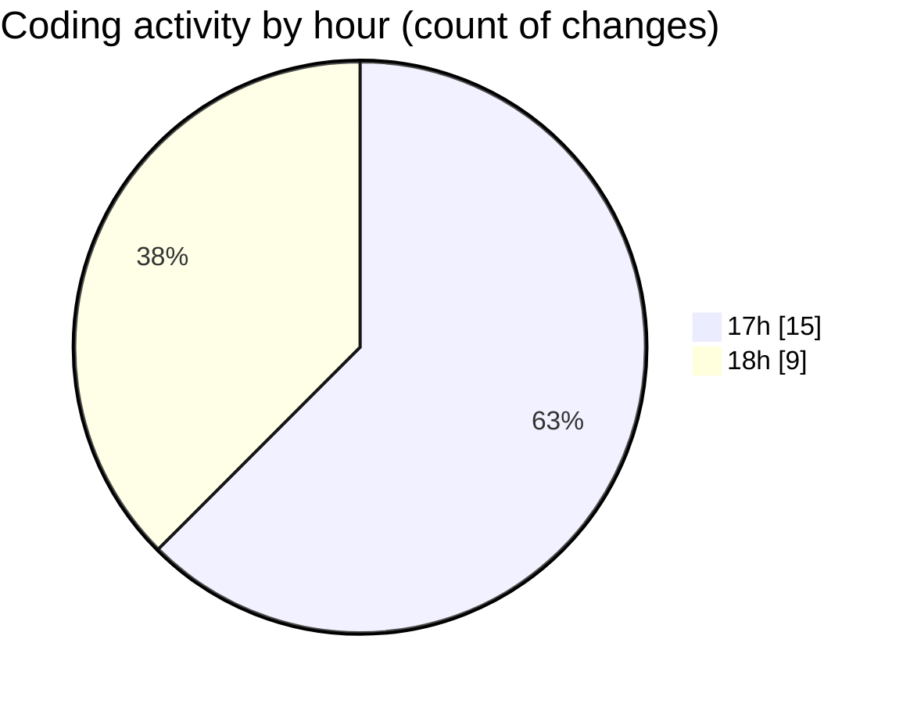

# jmasm - Activity Summary 

## Overall Statistics

| Stat                   | Value                                                             |
| ---------------------- | ----------------------------------------------------------------- |
| **Lines Added** (➕)   | 4091                                          |
| **Lines Removed** (➖) | 24                                        |
| **Net Change** (↕)    | 4067                |
| **Active Time** (⌚)   | 20 minutes |

## Modified Files
- **InterpTest.java** (+138, -1)
- **ArgumentParserTest.java** (+77, -0)
- **pom.xml** (+375, -18)
- **FunctionsTest.java** (+484, -1)
- **ModuleInit.java** (+139, -0)
- **interp.java** (+593, -2)
- **MNIMethodObject.java** (+195, -0)
- **Main.java** (+81, -0)
- **Functions.java** (+970, -0)
- **start.sh** (+4, -0)
- **common.java** (+374, -0)
- **common.java** (+374, -0)
- **Parsing.kt** (+160, -1)
- **Interpreterops.scala** (+127, -1)

## Visualizations

### By File Type (Lines Changed)

### By Hour (Estimated Activity Count)

> **Last Updated:** 09/03/2025, 18:15:06