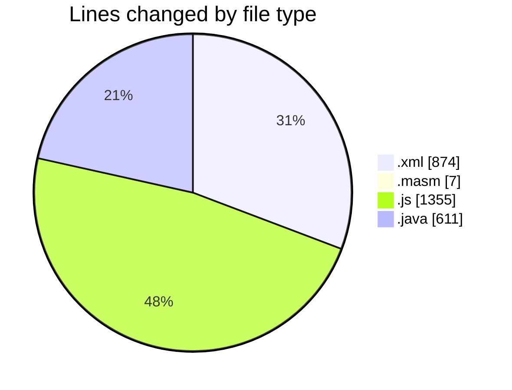
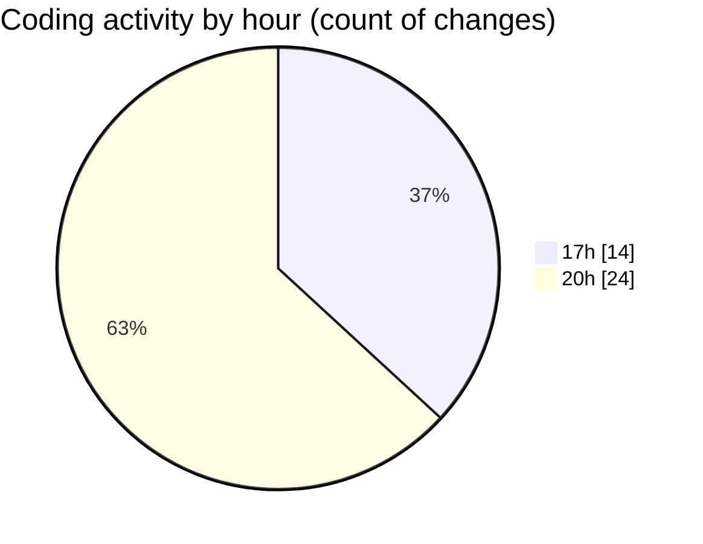

# jmasm - Activity Summary 

## Overall Statistics

| Stat                   | Value                                                             |
| ---------------------- | ----------------------------------------------------------------- |
| **Lines Added** (➕)   | 2587                                          |
| **Lines Removed** (➖) | 260                                        |
| **Net Change** (↕)    | 2327                |
| **Active Time** (⌚)   | 52 minutes |

## Modified Files
- **pom.xml** (+630, -244)
- **main.masm** (+7, -0)
- **masm.js** (+1355, -0)
- **PythonIntergrations.java** (+47, -10)
- **common.java** (+404, -6)
- **Main.java** (+89, -0)
- **ArgumentParser.java** (+55, -0)

## Visualizations

### By File Type (Lines Changed)

### By Hour (Estimated Activity Count)

> **Last Updated:** 11/03/2025, 20:44:41