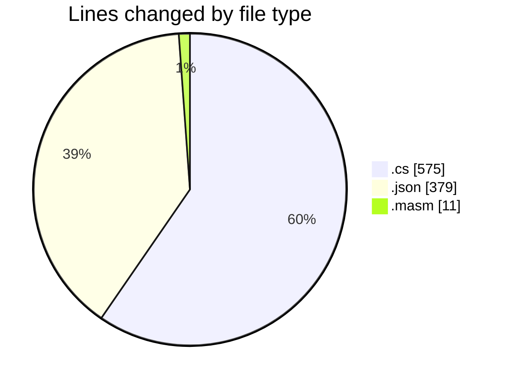
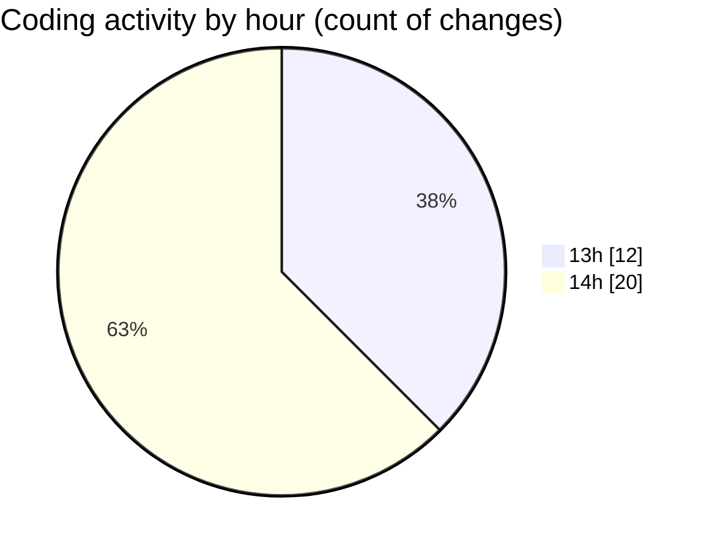

# SharpMASM - Activity Summary 

## Overall Statistics

| Stat                   | Value                                                             |
| ---------------------- | ----------------------------------------------------------------- |
| **Lines Added** (➕)   | 909                                          |
| **Lines Removed** (➖) | 56                                        |
| **Net Change** (↕)    | 853                |
| **Active Time** (⌚)   | 34 minutes |

## Modified Files
- **Includemanager.cs** (+64, -18)
- **Parsing.cs** (+278, -14)
- **Interp.cs** (+55, -24)
- **MASMException.cs** (+39, -0)
- **Program.cs** (+83, -0)
- **settings.json** (+379, -0)
- **main.masm** (+8, -0)
- **print.masm** (+3, -0)

## Visualizations

### By File Type (Lines Changed)

### By Hour (Estimated Activity Count)

> **Last Updated:** 3/15/2025, 2:44:56 PM