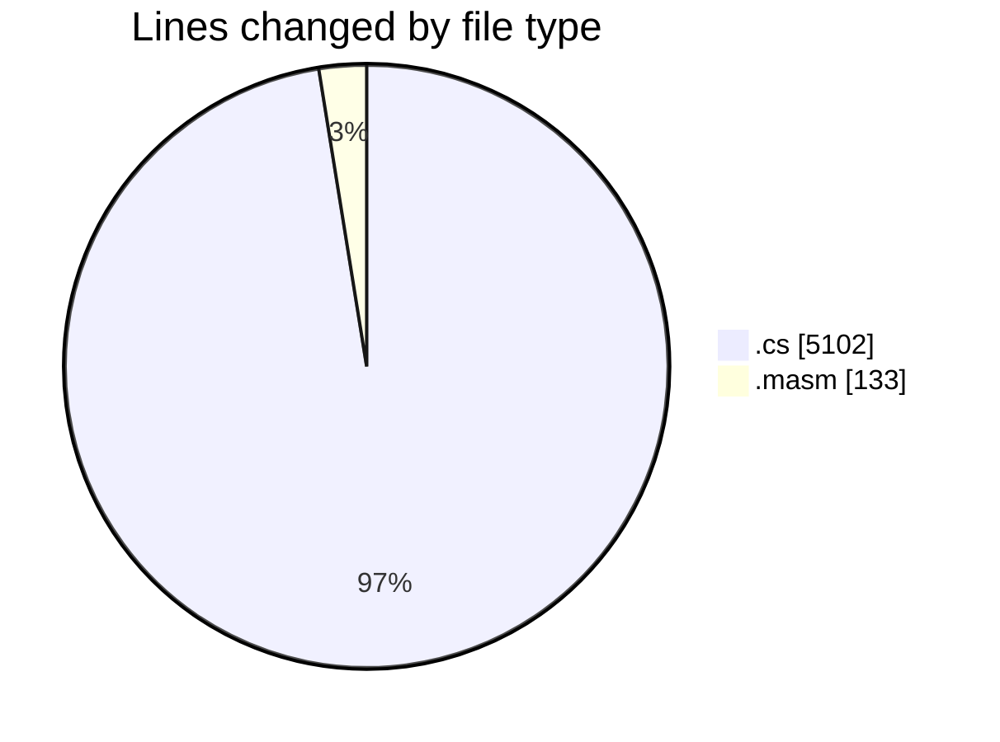
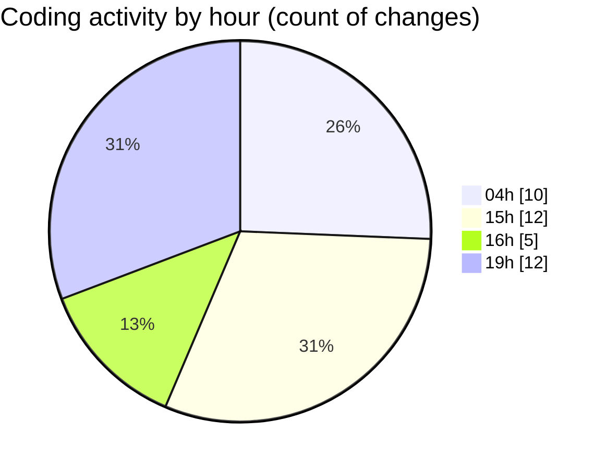

# SharpMASM - Activity Summary 

## Overall Statistics

| Stat                   | Value                                                             |
| ---------------------- | ----------------------------------------------------------------- |
| **Lines Added** (➕)   | 5208                                          |
| **Lines Removed** (➖) | 27                                        |
| **Net Change** (↕)    | 5181                |
| **Active Time** (⌚)   | 67 minutes |

## Modified Files
- **instructions.cs** (+1141, -19)
- **Program.cs** (+441, -3)
- **Parsing.cs** (+1001, -0)
- **Functions.cs** (+2010, -5)
- **test_labels.masm** (+75, -0)
- **test_counter.masm** (+58, -0)
- **MappedMemory.cs** (+482, -0)

## Visualizations

### By File Type (Lines Changed)

### By Hour (Estimated Activity Count)

> **Last Updated:** 3/17/2025, 7:46:17 PM