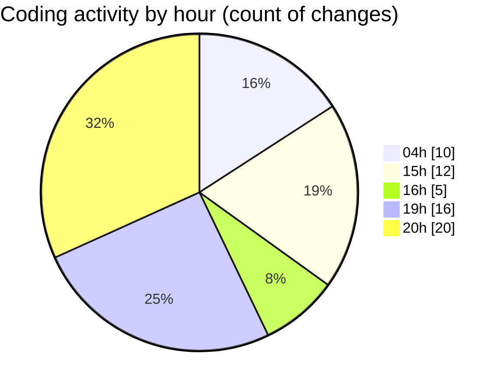

# SharpMASM - Activity Summary 

## Overall Statistics

| Stat                   | Value                                                             |
| ---------------------- | ----------------------------------------------------------------- |
| **Lines Added** (➕)   | 5987                                          |
| **Lines Removed** (➖) | 243                                        |
| **Net Change** (↕)    | 5744                |
| **Active Time** (⌚)   | 121 minutes |

## Modified Files
- **instructions.cs** (+1144, -20)
- **Program.cs** (+474, -5)
- **Parsing.cs** (+1274, -187)
- **Functions.cs** (+2213, -25)
- **test_labels.masm** (+75, -0)
- **test_counter.masm** (+58, -0)
- **MappedMemory.cs** (+515, -0)
- **Common.cs** (+174, -0)
- **CmdArgs.cs** (+60, -6)

## Visualizations

### By File Type (Lines Changed)

### By Hour (Estimated Activity Count)

> **Last Updated:** 3/17/2025, 8:36:07 PM