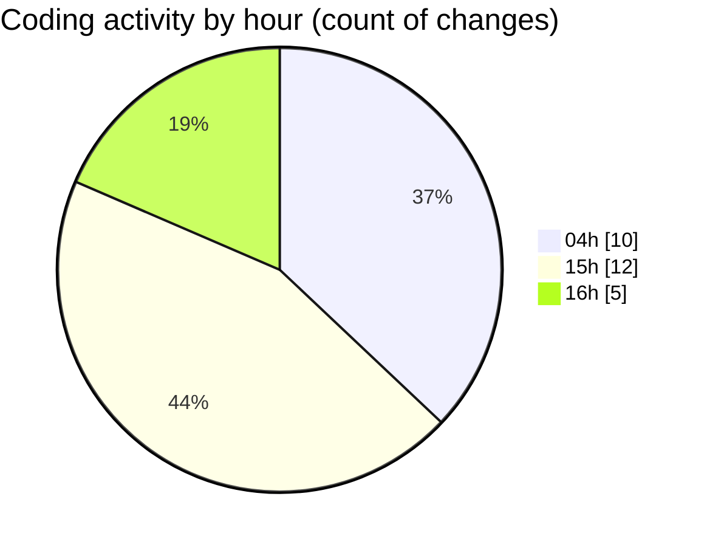

# SharpMASM - Activity Summary 

## Overall Statistics

| Stat                   | Value                                                             |
| ---------------------- | ----------------------------------------------------------------- |
| **Lines Added** (➕)   | 3329                                          |
| **Lines Removed** (➖) | 8                                        |
| **Net Change** (↕)    | 3321                |
| **Active Time** (⌚)   | 40 minutes |

## Modified Files
- **instructions.cs** (+734, -5)
- **Program.cs** (+296, -3)
- **Parsing.cs** (+648, -0)
- **Functions.cs** (+1331, -0)
- **test_labels.masm** (+50, -0)
- **test_counter.masm** (+29, -0)
- **MappedMemory.cs** (+241, -0)

## Visualizations

### By File Type (Lines Changed)

### By Hour (Estimated Activity Count)

> **Last Updated:** 3/17/2025, 4:15:41 PM