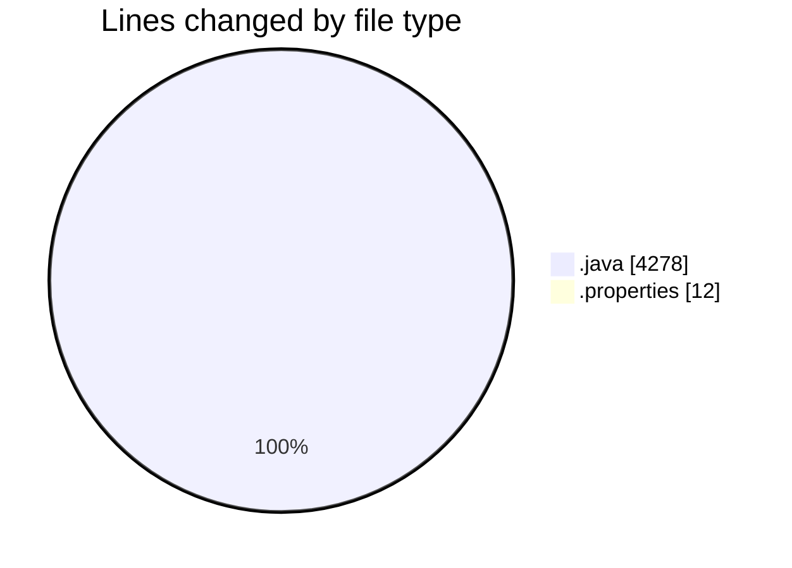
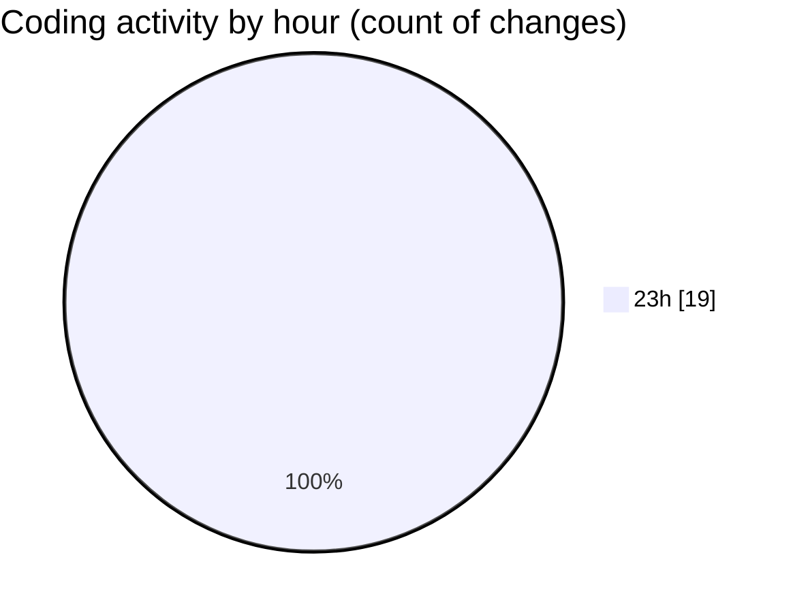

# jmasm - Activity Summary 

## Overall Statistics

| Stat                   | Value                                                             |
| ---------------------- | ----------------------------------------------------------------- |
| **Lines Added** (➕)   | 4285                                          |
| **Lines Removed** (➖) | 5                                        |
| **Net Change** (↕)    | 4280                |
| **Active Time** (⌚)   | 17 minutes |

## Modified Files
- **MemoryMappedManager.java** (+230, -0)
- **MASMConfig.java** (+100, -0)
- **common.java** (+804, -0)
- **masm.properties** (+12, -0)
- **interp.java** (+1193, -0)
- **Functions.java** (+1940, -0)
- **MemoryMappedFileManager.java** (+6, -5)

## Visualizations

### By File Type (Lines Changed)

### By Hour (Estimated Activity Count)

> **Last Updated:** 18/03/2025, 23:49:26