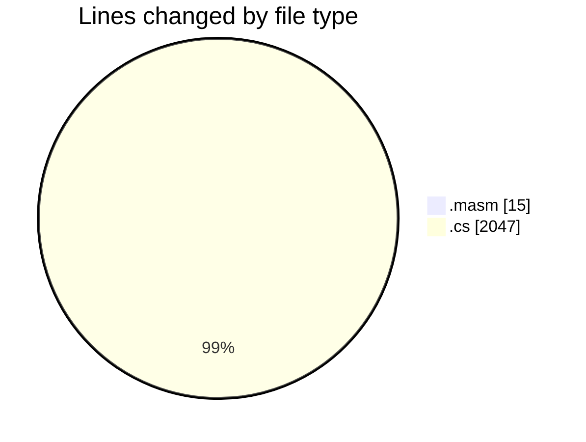
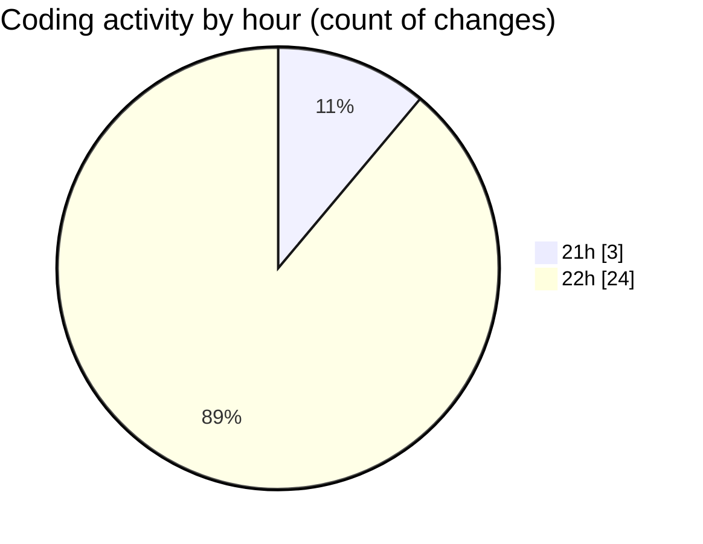

# SharpMASM - Activity Summary 

## Overall Statistics

| Stat                   | Value                                                             |
| ---------------------- | ----------------------------------------------------------------- |
| **Lines Added** (➕)   | 2042                                          |
| **Lines Removed** (➖) | 20                                        |
| **Net Change** (↕)    | 2022                |
| **Active Time** (⌚)   | 36 minutes |

## Modified Files
- **main.masm** (+8, -7)
- **Parsing.cs** (+352, -0)
- **Functions.cs** (+773, -5)
- **MNICore.cs** (+163, -0)
- **MNIModuleManager.cs** (+160, -0)
- **StringOperationsModule.cs** (+88, -0)
- **IOModule.cs** (+47, -0)
- **Common.cs** (+169, -0)
- **MappedMemory.cs** (+282, -8)

## Visualizations

### By File Type (Lines Changed)

### By Hour (Estimated Activity Count)

> **Last Updated:** 18/03/2025, 22:56:53