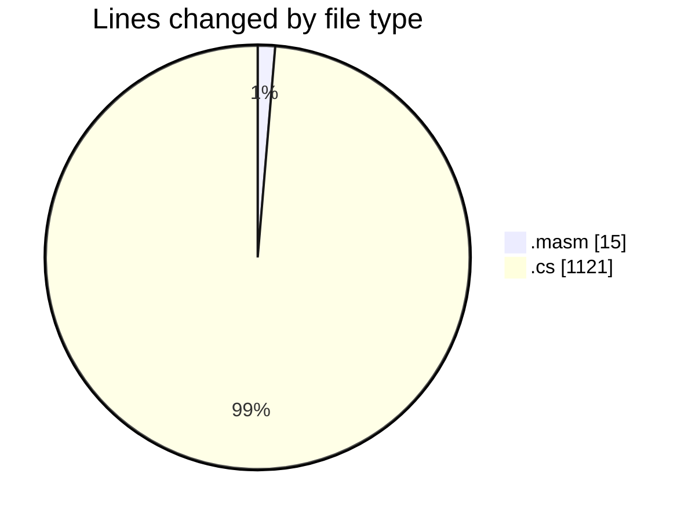
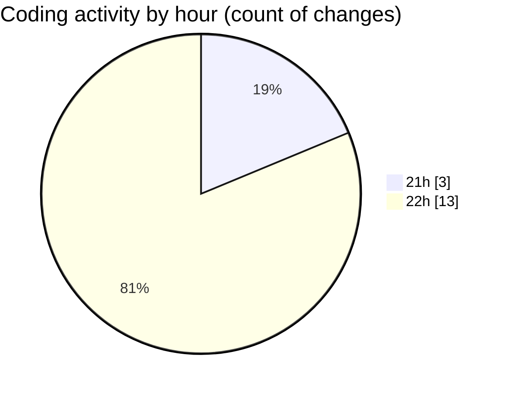

# SharpMASM - Activity Summary 

## Overall Statistics

| Stat                   | Value                                                             |
| ---------------------- | ----------------------------------------------------------------- |
| **Lines Added** (➕)   | 1124                                          |
| **Lines Removed** (➖) | 12                                        |
| **Net Change** (↕)    | 1112                |
| **Active Time** (⌚)   | 19 minutes |

## Modified Files
- **main.masm** (+8, -7)
- **Parsing.cs** (+352, -0)
- **Functions.cs** (+760, -5)
- **MNICore.cs** (+1, -0)
- **MNIModuleManager.cs** (+1, -0)
- **StringOperationsModule.cs** (+1, -0)
- **IOModule.cs** (+1, -0)

## Visualizations

### By File Type (Lines Changed)

### By Hour (Estimated Activity Count)

> **Last Updated:** 18/03/2025, 22:47:45