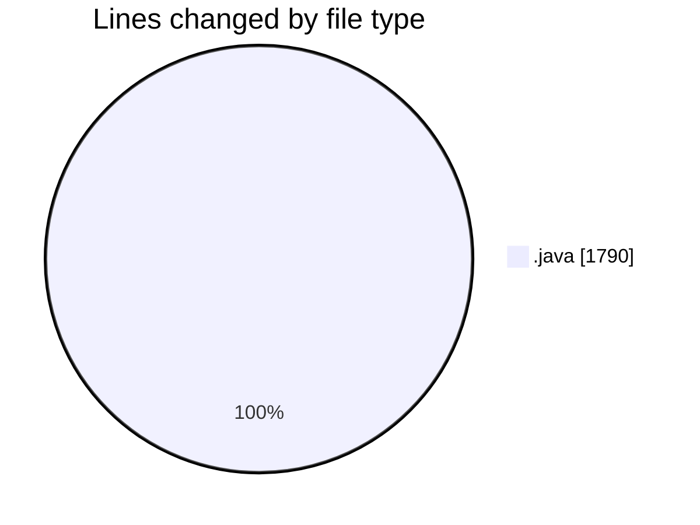
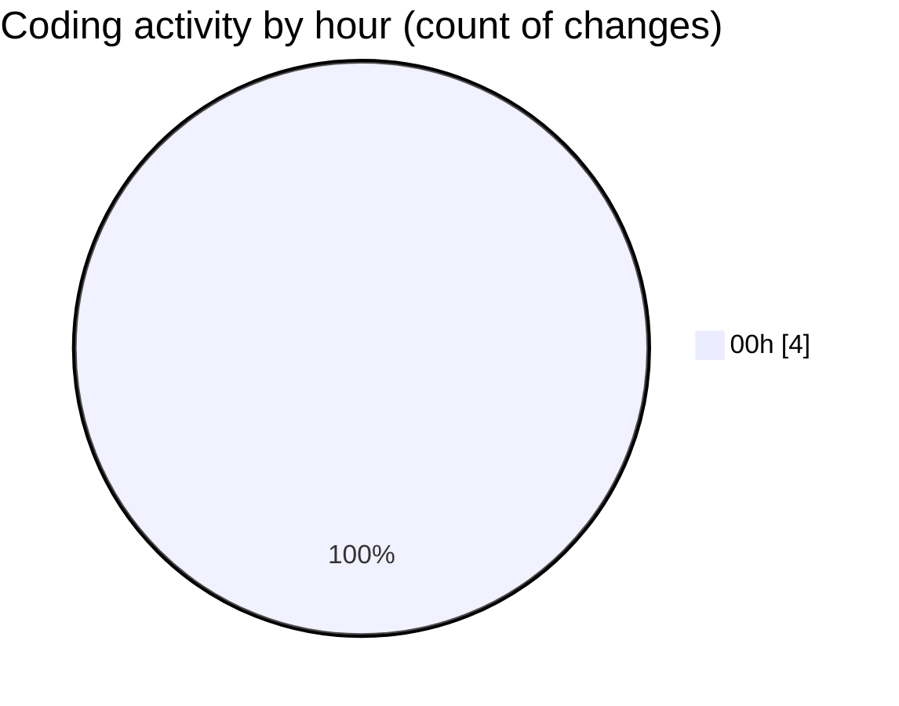

# jmasm - Activity Summary 

## Overall Statistics

| Stat                   | Value                                                             |
| ---------------------- | ----------------------------------------------------------------- |
| **Lines Added** (➕)   | 1790                                          |
| **Lines Removed** (➖) | 0                                        |
| **Net Change** (↕)    | 1790                |
| **Active Time** (⌚)   | 3 minutes |

## Modified Files
- **MemoryAdapter.java** (+1, -0)
- **Functions.java** (+971, -0)
- **debug.java** (+217, -0)
- **interp.java** (+601, -0)

## Visualizations

### By File Type (Lines Changed)

### By Hour (Estimated Activity Count)

> **Last Updated:** 19/03/2025, 00:07:32