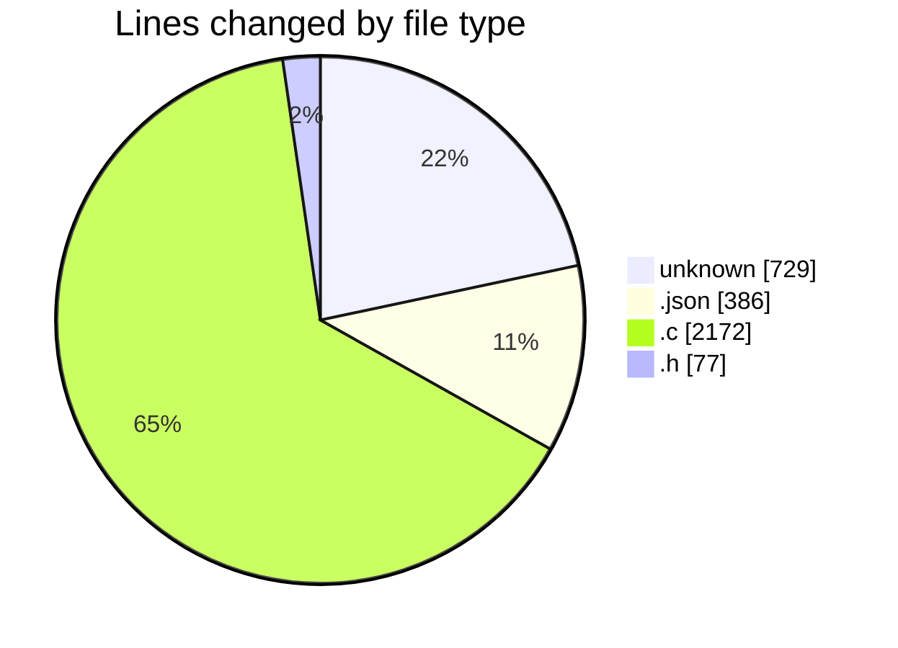
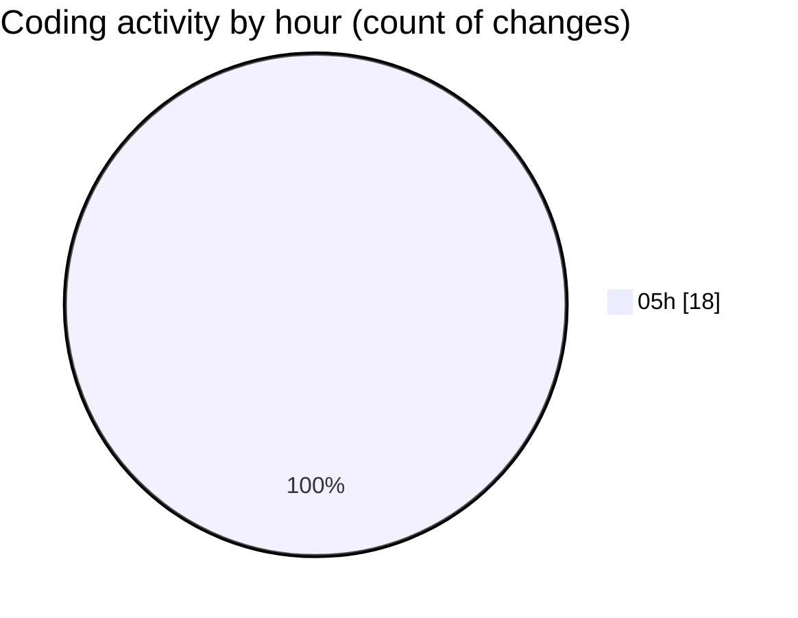

# konstruct - Activity Summary 

## Overall Statistics

| Stat                   | Value                                                             |
| ---------------------- | ----------------------------------------------------------------- |
| **Lines Added** (➕)   | 3233                                          |
| **Lines Removed** (➖) | 131                                        |
| **Net Change** (↕)    | 3102                |
| **Active Time** (⌚)   | 19 minutes |

## Modified Files
- **LICENSE** (+662, -0)
- **settings.json** (+386, -0)
- **hello.c** (+7, -0)
- **.gitignore** (+46, -21)
- **font.h** (+24, -22)
- **iso9660.c** (+202, -0)
- **stdio.c** (+727, -0)
- **fs.c** (+930, -0)
- **bootdev.c** (+218, -88)
- **globals.h** (+31, -0)

## Visualizations

### By File Type (Lines Changed)

### By Hour (Estimated Activity Count)

> **Last Updated:** 03/04/2025, 05:46:33