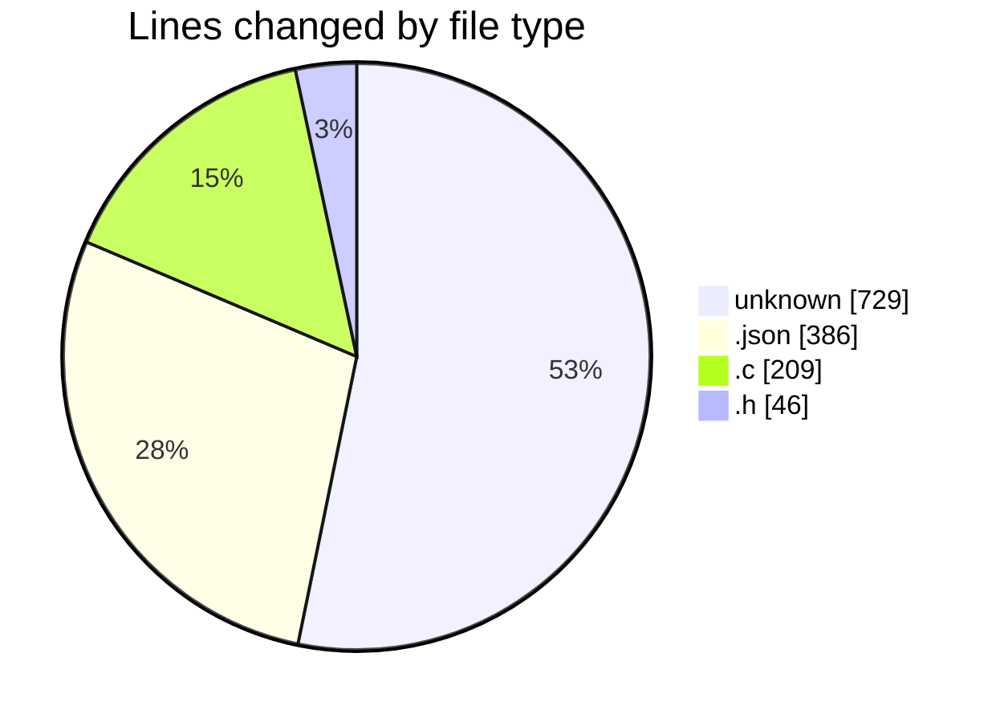

# konstruct - Activity Summary 

## Overall Statistics

| Stat                   | Value                                                             |
| ---------------------- | ----------------------------------------------------------------- |
| **Lines Added** (➕)   | 1327                                          |
| **Lines Removed** (➖) | 43                                        |
| **Net Change** (↕)    | 1284                |
| **Active Time** (⌚)   | 9 minutes |

## Modified Files
- **LICENSE** (+662, -0)
- **settings.json** (+386, -0)
- **hello.c** (+7, -0)
- **.gitignore** (+46, -21)
- **font.h** (+24, -22)
- **iso9660.c** (+202, -0)

## Visualizations

### By File Type (Lines Changed)

### By Hour (Estimated Activity Count)

> **Last Updated:** 03/04/2025, 05:41:33