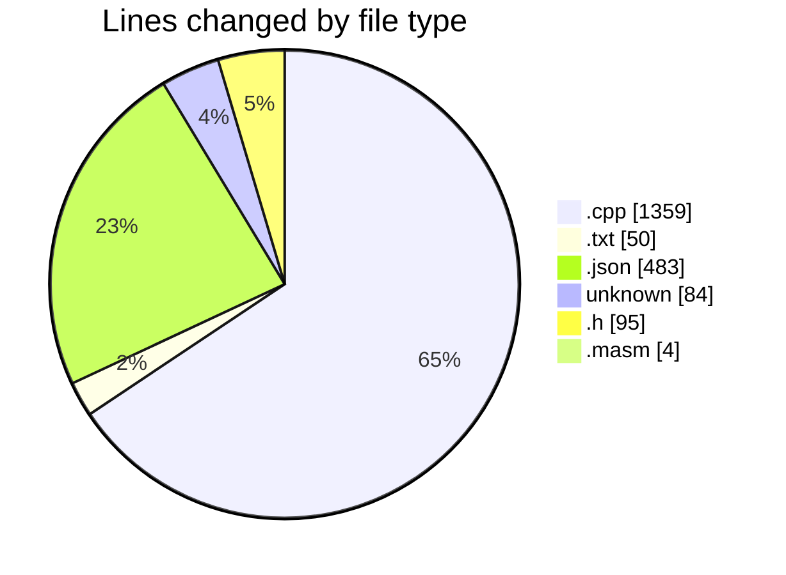
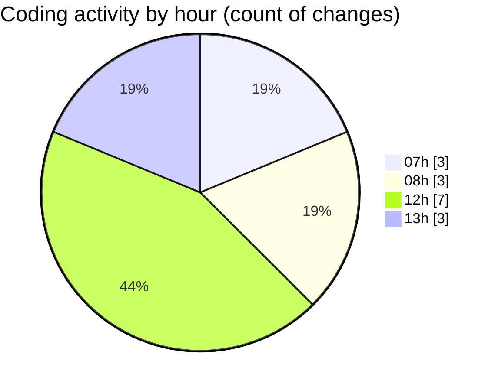

# C-Masm - Activity Summary 

## Overall Statistics

| Stat                   | Value                                                             |
| ---------------------- | ----------------------------------------------------------------- |
| **Lines Added** (➕)   | 2070                                          |
| **Lines Removed** (➖) | 5                                        |
| **Net Change** (↕)    | 2065                |
| **Active Time** (⌚)   | 15 minutes |

## Modified Files
- **microasm_decoder.cpp** (+306, -0)
- **CMakeLists.txt** (+46, -4)
- **settings.json** (+386, -0)
- **main.cpp** (+191, -0)
- **.gitignore** (+84, -0)
- **microasm_interpreter.cpp** (+862, -0)
- **settings.json** (+97, -0)
- **microasm_interpreter.h** (+94, -1)
- **main.masm** (+4, -0)

## Visualizations

### By File Type (Lines Changed)

### By Hour (Estimated Activity Count)

> **Last Updated:** 28/04/2025, 13:04:00