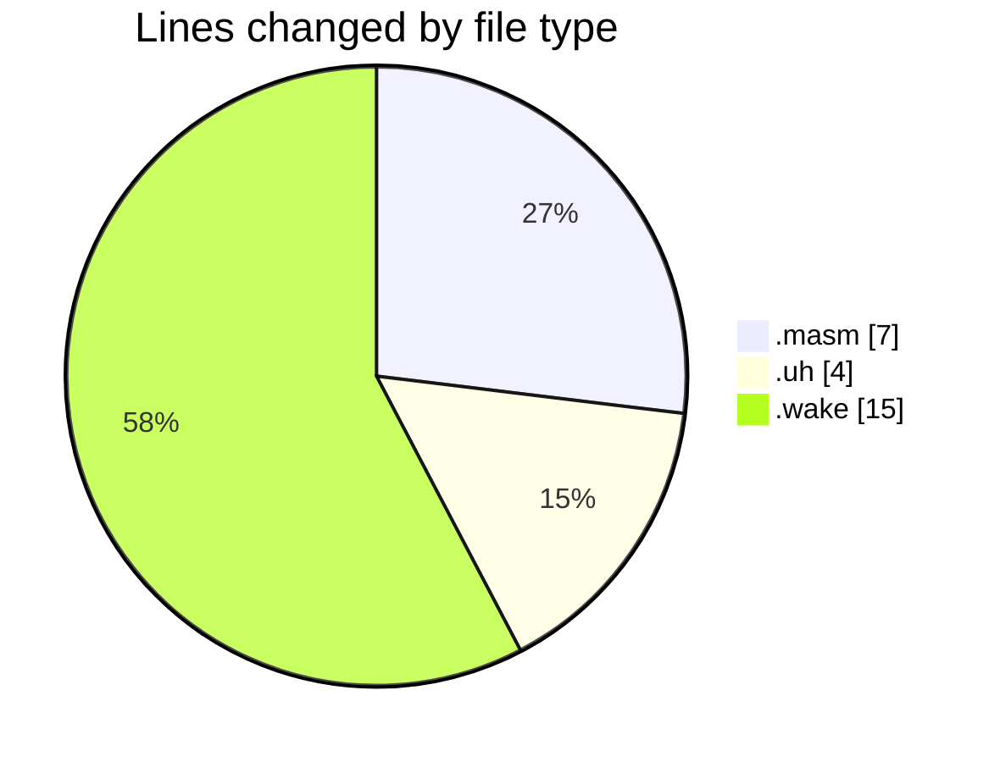
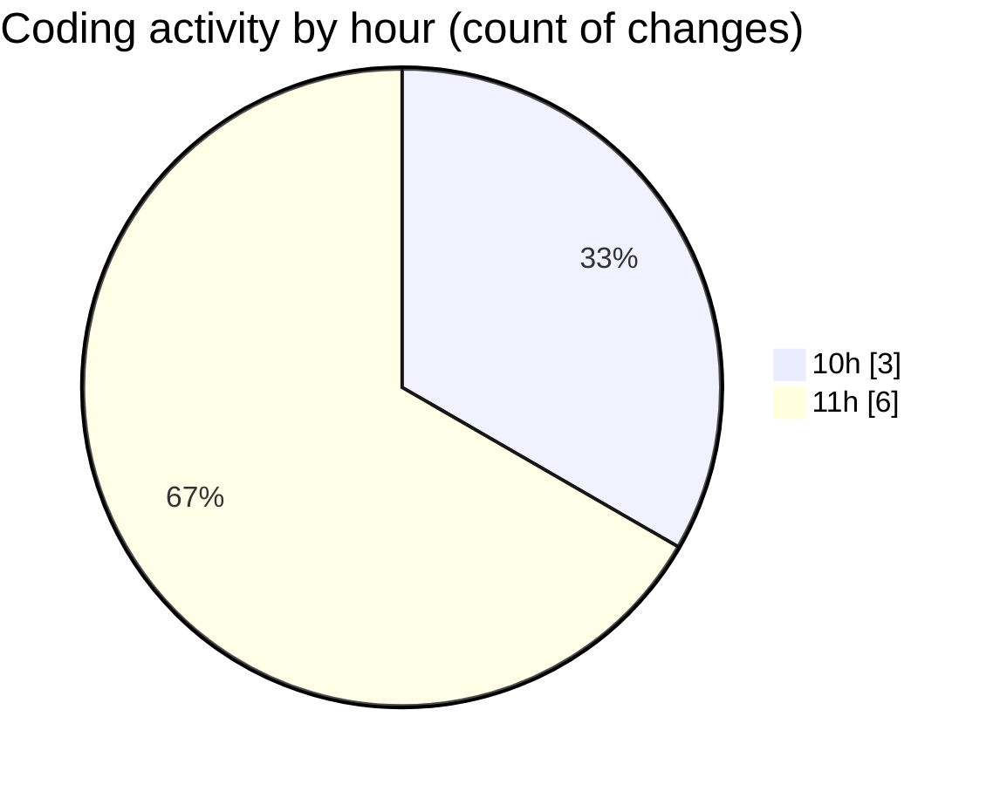

# Micro-Assembly - Activity Summary 

## Overall Statistics

| Stat                   | Value                                                             |
| ---------------------- | ----------------------------------------------------------------- |
| **Lines Added** (➕)   | 26                                          |
| **Lines Removed** (➖) | 0                                        |
| **Net Change** (↕)    | 26                |
| **Active Time** (⌚)   | 8 minutes |

## Modified Files
- **hello.masm** (+7, -0)
- **hello.uh** (+4, -0)
- **hello.wake** (+15, -0)

## Visualizations

### By File Type (Lines Changed)

### By Hour (Estimated Activity Count)

> **Last Updated:** 28/04/2025, 11:06:54