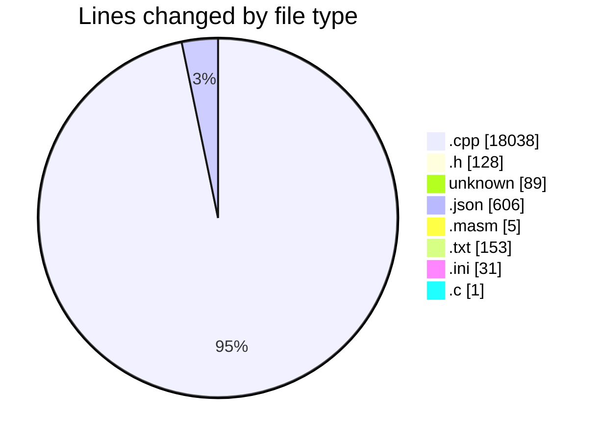
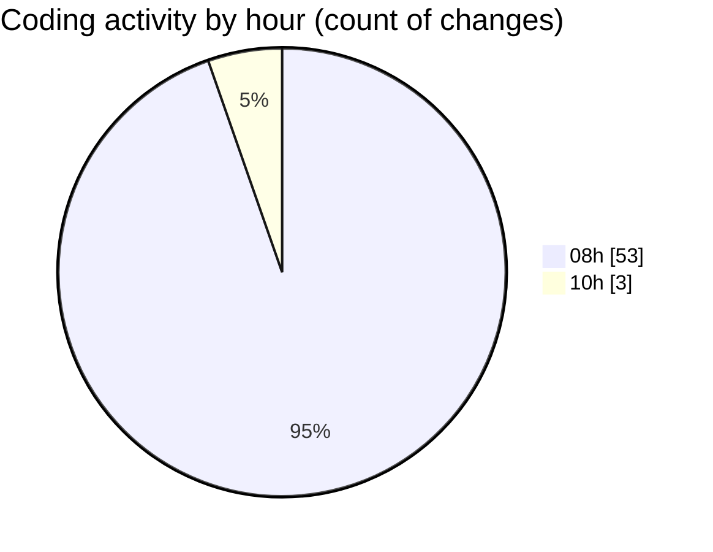

# C-Masm - Activity Summary 

## Overall Statistics

| Stat                   | Value                                                             |
| ---------------------- | ----------------------------------------------------------------- |
| **Lines Added** (➕)   | 18700                                          |
| **Lines Removed** (➖) | 351                                        |
| **Net Change** (↕)    | 18349                |
| **Active Time** (⌚)   | 92 minutes |

## Modified Files
- **microasm_interpreter.cpp** (+1755, -238)
- **microasm_interpreter.h** (+105, -6)
- **.gitignore** (+89, -0)
- **settings.json** (+218, -0)
- **main.masm** (+5, -0)
- **MNI.cpp** (+53, -23)
- **MNI.h** (+17, -0)
- **CMakeLists.txt** (+102, -51)
- **microasm_compiler.cpp** (+723, -0)
- **strings.cpp** (+48, -22)
- **microasm_capi.cpp** (+198, -0)
- **imgui.ini** (+20, -11)
- **imgui_tables.cpp** (+4526, -0)
- **imgui_widgets.cpp** (+10452, -0)
- **main.c** (+1, -0)
- **settings.json** (+388, -0)

## Visualizations

### By File Type (Lines Changed)

### By Hour (Estimated Activity Count)

> **Last Updated:** 29/04/2025, 10:31:16