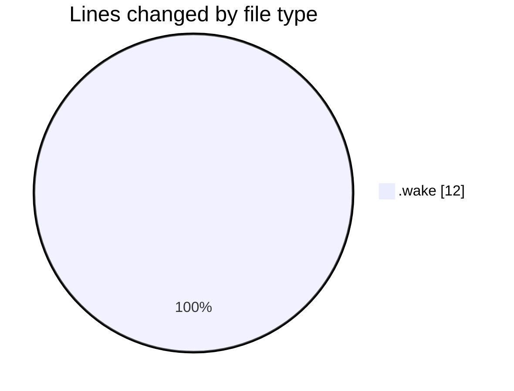
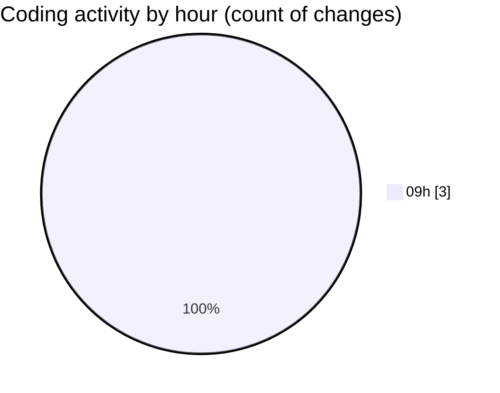

# stdlib - Activity Summary 

## Overall Statistics

| Stat                   | Value                                                             |
| ---------------------- | ----------------------------------------------------------------- |
| **Lines Added** (➕)   | 11                                          |
| **Lines Removed** (➖) | 1                                        |
| **Net Change** (↕)    | 10                |
| **Active Time** (⌚)   | 2 minutes |

## Modified Files
- **print.wake** (+11, -1)

## Visualizations

### By File Type (Lines Changed)

### By Hour (Estimated Activity Count)

> **Last Updated:** 29/04/2025, 09:21:49