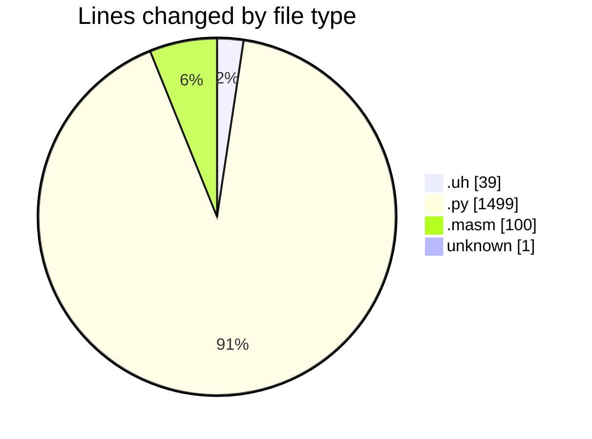
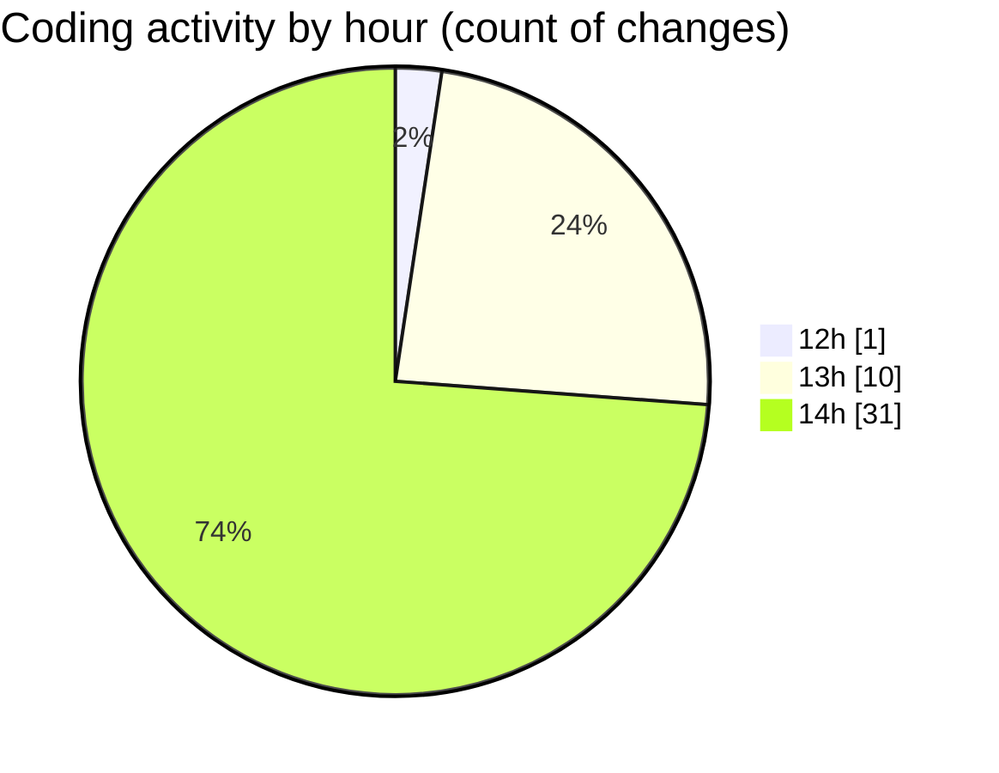

# uhigh-lang - Activity Summary 

## Overall Statistics

| Stat                   | Value                                                             |
| ---------------------- | ----------------------------------------------------------------- |
| **Lines Added** (➕)   | 1338                                          |
| **Lines Removed** (➖) | 301                                        |
| **Net Change** (↕)    | 1037                |
| **Active Time** (⌚)   | 60 minutes |

## Modified Files
- **test.uh** (+4, -0)
- **compiler.py** (+354, -0)
- **main.masm** (+68, -32)
- **main.uh** (+26, -9)
- **.gitignore** (+1, -0)
- **uhigh.py** (+389, -12)
- **parser.py** (+496, -248)

## Visualizations

### By File Type (Lines Changed)

### By Hour (Estimated Activity Count)

> **Last Updated:** 29/04/2025, 14:42:12