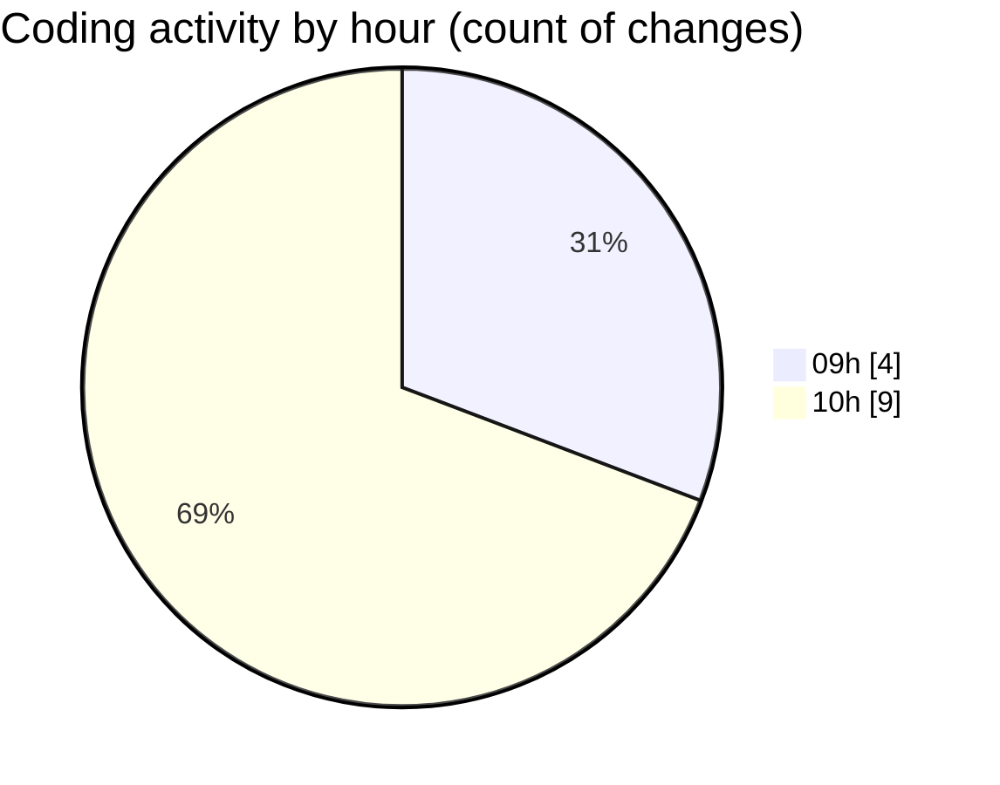

# Wake-Lang - Activity Summary 

## Overall Statistics

| Stat                   | Value                                                             |
| ---------------------- | ----------------------------------------------------------------- |
| **Lines Added** (➕)   | 1336                                          |
| **Lines Removed** (➖) | 452                                        |
| **Net Change** (↕)    | 884                |
| **Active Time** (⌚)   | 13 minutes |

## Modified Files
- **scons-debug.py** (+11, -0)
- **scons-report.txt** (+65, -0)
- **codegen.py** (+189, -0)
- **main.wake** (+12, -0)
- **lexer.py** (+159, -3)
- **parser.py** (+893, -449)
- **main.masm** (+7, -0)

## Visualizations

### By File Type (Lines Changed)

### By Hour (Estimated Activity Count)

> **Last Updated:** 29/04/2025, 10:07:53