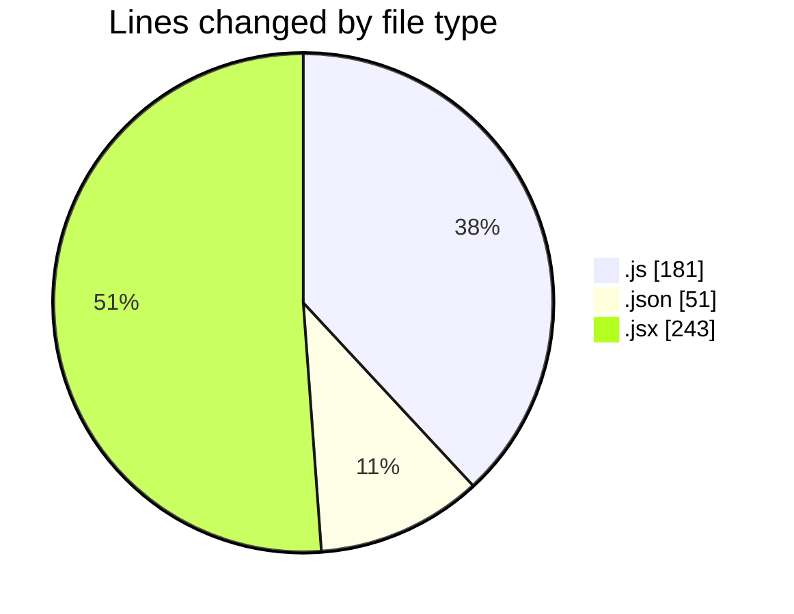
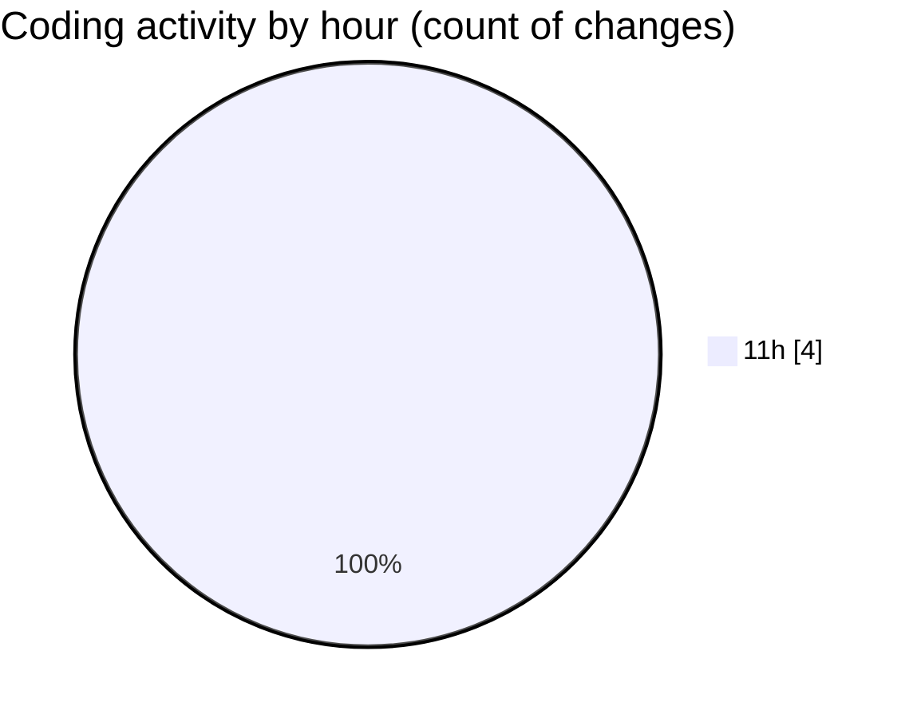

# finite.vercel.app - Activity Summary 

## Overall Statistics

| Stat                   | Value                                                             |
| ---------------------- | ----------------------------------------------------------------- |
| **Lines Added** (➕)   | 462                                          |
| **Lines Removed** (➖) | 13                                        |
| **Net Change** (↕)    | 449                |
| **Active Time** (⌚)   | 4 minutes |

## Modified Files
- **data.js** (+168, -13)
- **package.json** (+51, -0)
- **masm.jsx** (+243, -0)

## Visualizations

### By File Type (Lines Changed)

### By Hour (Estimated Activity Count)

> **Last Updated:** 30/04/2025, 11:59:30