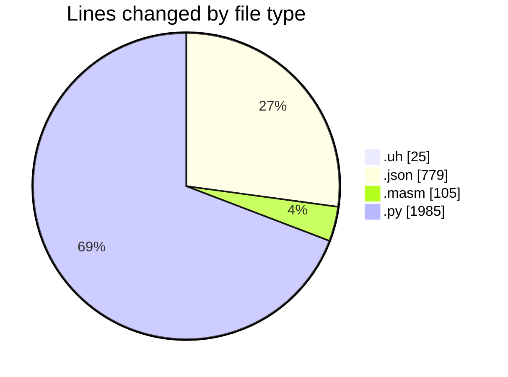
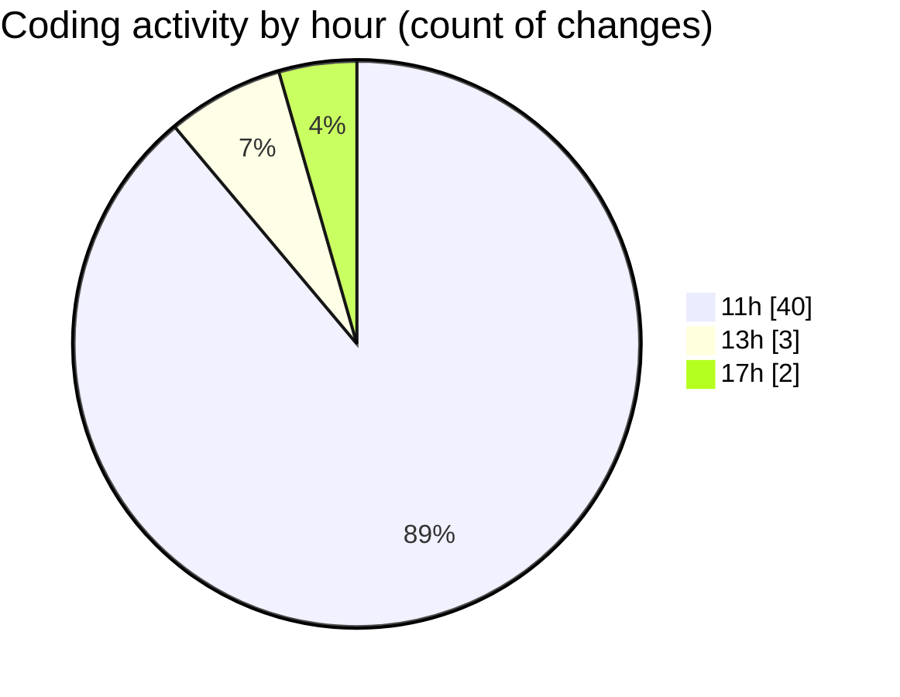

# uhigh-lang - Activity Summary 

## Overall Statistics

| Stat                   | Value                                                             |
| ---------------------- | ----------------------------------------------------------------- |
| **Lines Added** (➕)   | 2635                                          |
| **Lines Removed** (➖) | 259                                        |
| **Net Change** (↕)    | 2376                |
| **Active Time** (⌚)   | 64 minutes |

## Modified Files
- **main.uh** (+24, -1)
- **settings.json** (+776, -0)
- **main.masm** (+77, -28)
- **uhigh.py** (+1335, -223)
- **parser.py** (+291, -2)
- **lexer.py** (+129, -5)
- **settings.json** (+3, -0)

## Visualizations

### By File Type (Lines Changed)

### By Hour (Estimated Activity Count)

> **Last Updated:** 30/04/2025, 17:28:50