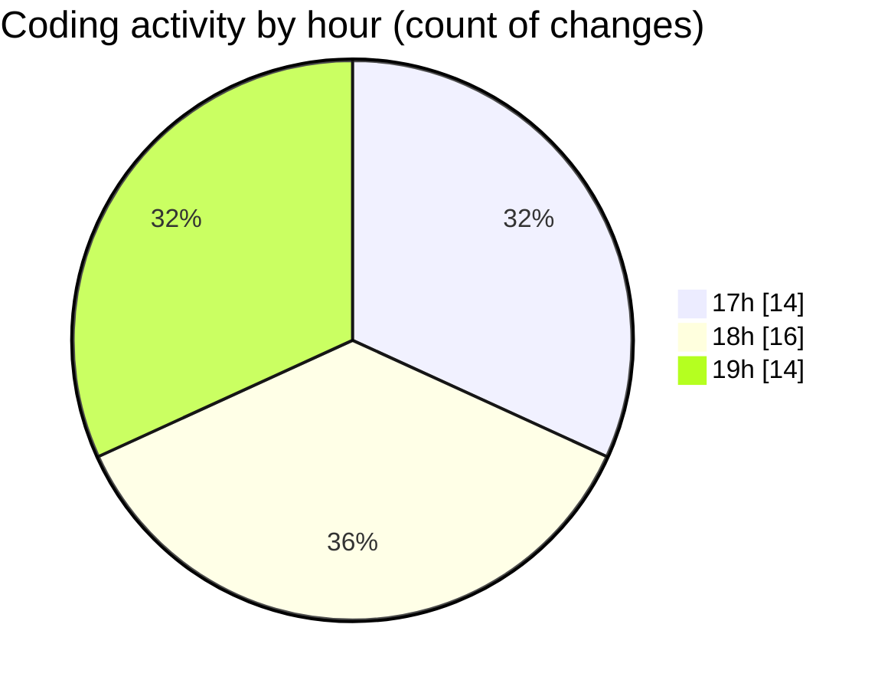

# jmasm - Activity Summary 

## Overall Statistics

| Stat                   | Value                                                             |
| ---------------------- | ----------------------------------------------------------------- |
| **Lines Added** (➕)   | 5021                                          |
| **Lines Removed** (➖) | 159                                        |
| **Net Change** (↕)    | 4862                |
| **Active Time** (⌚)   | 50 minutes |

## Modified Files
- **ArgumentParserTest.java** (+77, -0)
- **pom.xml** (+375, -12)
- **InterpTest.java** (+138, -1)
- **interp.java** (+592, -0)
- **FunctionsTest.java** (+484, -1)
- **ModuleInit.java** (+278, -0)
- **Main.java** (+178, -0)
- **MNIMethodObject.java** (+195, -0)
- **Functions.java** (+2266, -138)
- **common.java** (+401, -7)
- **IO.java** (+37, -0)

## Visualizations

### By File Type (Lines Changed)

### By Hour (Estimated Activity Count)

> **Last Updated:** 01/05/2025, 19:28:28